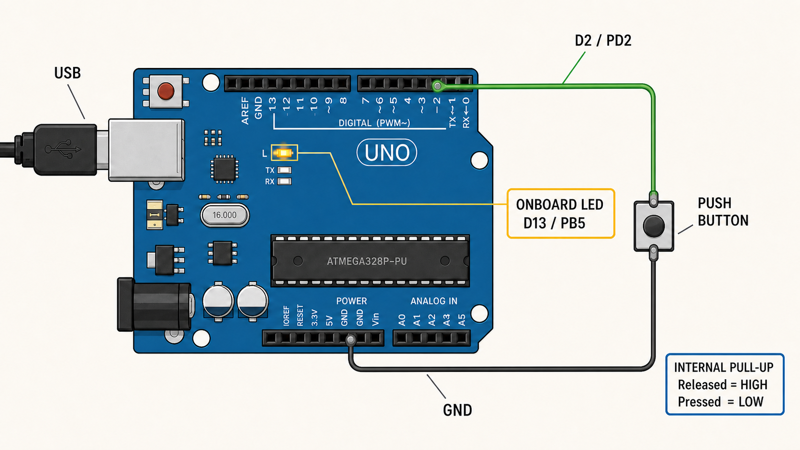

# EP01 - GPIO: Digital Input และ Output

EP นี้เรียนรู้การควบคุมขา Digital ของ ATmega328P โดยตรงด้วยภาษา C
แบบ Register-Level โดยไม่ใช้ `pinMode()`, `digitalRead()` และ
`digitalWrite()` ของ Arduino Framework

เมื่ออ่านจบ EP นี้ควรตอบได้ว่า:

- Register คืออะไร และต่างจากตัวแปรทั่วไปอย่างไร
- ทำไมขา Arduino D13 จึงกลายเป็น `PB5`
- `DDRB`, `PORTB`, `DDRD`, `PORTD` และ `PIND` มาจากไหน
- `(1U << DDB5)` สร้างค่าอะไร
- `|=`, `&= ~` และ `&` ต่างกันอย่างไร
- ทำไมปุ่มที่ต่อแบบ Pull-up จึงอ่านค่า `LOW` เมื่อกด

> EP01 หน้านี้เป็นบทเรียนหลักและอ่านได้จบในหน้าเดียว ส่วนไฟล์ใน `docs/`
> เป็นเอกสารอ้างอิงสำหรับกลับมาเปิดดูภายหลัง ไม่จำเป็นต้องอ่านก่อน

## Chapter 1 — การต่อวงจร

| อุปกรณ์ | การเชื่อมต่อ |
| --- | --- |
| Arduino Uno | ต่อ USB เพื่อจ่ายไฟและ Upload |
| Push button | ขาหนึ่งต่อ D2 อีกขาต่อ GND |
| LED | ใช้ LED บนบอร์ดที่ D13 |



*สายสีเขียวต่อจาก D2 ไปยัง Push button และสายสีดำต่อจากปุ่มลง GND
ส่วน LED ใช้ LED บนบอร์ดที่ D13 จึงไม่ต้องต่อ LED ภายนอก*

วงจรปุ่มใช้ Internal Pull-up ของ ATmega328P จึงไม่ต้องเพิ่มตัวต้านทาน
Pull-up ภายนอกในตัวอย่างนี้

```text
ปล่อยปุ่ม  -> D2 ถูกดึงขึ้นเป็น HIGH
กดปุ่ม    -> D2 ต่อถึง GND และอ่านได้ LOW
```

ถ้าใช้ LED ภายนอก ให้ต่อ D13 ผ่านตัวต้านทานประมาณ 220 โอห์มถึง 1 กิโลโอห์ม
เข้าขา Anode ของ LED และต่อ Cathode ลง GND

## Chapter 2 — D13 ไม่ใช่ชื่อขาของ MCU

ชื่อ D13 และ D2 เป็นชื่อที่พิมพ์อยู่บนบอร์ด Arduino Uno แต่ภายใน
ATmega328P จัดกลุ่มขาเป็น Port B, Port C และ Port D

เส้นทางการหาชื่อ Register คือ:

```text
ชื่อขาบนบอร์ด -> Arduino Uno pinout -> ขา MCU -> Register ใน datasheet
D13           -> PB5                -> bit 5  -> DDRB / PORTB / PINB
D2            -> PD2                -> bit 2  -> DDRD / PORTD / PIND
```

| ขาบน Uno | ชื่อใน MCU | หมายความว่า | Register ที่เกี่ยวข้อง |
| --- | --- | --- | --- |
| D13 | `PB5` | Port B, bit 5 | `DDRB`, `PORTB`, `PINB` |
| D2 | `PD2` | Port D, bit 2 | `DDRD`, `PORTD`, `PIND` |

ข้อมูลส่วนนี้มาจากสองแหล่งหลัก:

1. [เอกสาร Arduino Uno R3](https://docs.arduino.cc/hardware/uno-rev3/)
   ใช้แปลงชื่อขาบนบอร์ด เช่น D13 ไปเป็นขาของ MCU เช่น PB5
2. [หน้าผลิตภัณฑ์และ Datasheet ของ ATmega328P](https://www.microchip.com/en-us/product/atmega328p)
   ใช้ดูหน้าที่ของ `DDRx`, `PORTx`, `PINx` และรายละเอียดแต่ละ bit

ตัวอักษร `x` ในชื่อ `DDRx`, `PORTx`, `PINx` หมายถึงชื่อ Port เช่น
Port B จะได้ `DDRB`, `PORTB`, `PINB`

## Chapter 3 — Register คืออะไร

Register (เรจิสเตอร์) คือช่องเก็บค่าขนาดเล็กที่อยู่ภายใน Hardware ของ MCU
แต่ละ Register มีตำแหน่ง Address คงที่ตามที่ผู้ผลิตกำหนด และเชื่อมต่อกับ
วงจรภายใน เช่น GPIO, Timer, UART หรือ ADC

สำหรับ ATmega328P Register ของ Peripheral ส่วนใหญ่มีขนาด 8 bit:

```text
bit number     7      6      5      4      3      2      1      0
DDRB bit name DDB7   DDB6   DDB5   DDB4   DDB3   DDB2   DDB1   DDB0
                            ^
                            bit ที่ควบคุม PB5 / Uno D13
```

แต่ละ bit ทำหน้าที่เหมือนสวิตช์ควบคุมหรือแสดงสถานะส่วนหนึ่งของ Hardware
ตัวอย่างเช่น bit 5 ของ `DDRB` กำหนดทิศทางของขา PB5:

```text
DDB5 = 0  -> PB5 เป็น Input
DDB5 = 1  -> PB5 เป็น Output
```

### Register ไม่ใช่ตัวแปรธรรมดา

เมื่อ CPU อ่านหรือเขียน Register จะเป็นการติดต่อกับวงจรฮาร์ดแวร์ จริง
จึงต่างจากตัวแปรภาษา C ที่ใช้เก็บข้อมูลใน SRAM

| หัวข้อ | Register ฮาร์ดแวร์ เช่น `DDRB` | ตัวแปร C เช่น `uint8_t ledState` |
| --- | --- | --- |
| อยู่ที่ไหน | วงจร Peripheral ภายใน MCU | SRAM |
| Address | ผู้ผลิตกำหนดไว้ตายตัว | Compiler/Linker จัดสรรให้ |
| เมื่อเขียนค่า | อาจเปลี่ยนการทำงานของฮาร์ดแวร์ ทันที | เปลี่ยนเพียงข้อมูลในหน่วยความจำ |
| เมื่ออ่านค่า | อาจได้สถานะปัจจุบันจากฮาร์ดแวร์ | ได้ค่าที่โปรแกรมเก็บไว้ |
| ชื่อมาจากไหน | Datasheet และ Device Header | ผู้เขียนโปรแกรมตั้งชื่อเอง |

จากมุมมองของ CPU Register เหล่านี้มีลักษณะคล้ายตำแหน่งหน่วยความจำ
แต่ด้านหลัง Address นั้นเชื่อมกับวงจร Peripheral แนวคิดนี้เรียกว่า
Memory-mapped I/O

```text
โค้ด C เขียน DDRB -> Address ของ DDRB -> วงจรกำหนดทิศทางขา Port B
```

Device Header ประกาศ Register เป็น `volatile` ไว้แล้ว เพื่อบอก Compiler ว่า
ค่าที่ Address นี้เกี่ยวข้องกับฮาร์ดแวร์ และต้องอ่านหรือเขียนจริงตามคำสั่ง
ไม่ควรถูกตัดทิ้งเหมือนการคำนวณที่ไม่มีผลลัพธ์

### `DDRB` กับ `DDB5` ไม่ใช่สิ่งเดียวกัน

```c
DDRB |= (1U << DDB5);
```

- `DDRB` คือ Register ทั้งก้อนขนาด 8 bit
- `DDB5` คือหมายเลขตำแหน่ง bit 5 ภายใน `DDRB`
- `(1U << DDB5)` คือ Mask ที่เลือกเฉพาะ bit 5
- `|=` คือการเขียนให้ bit 5 เป็น 1 โดยรักษา bit อื่นไว้

`DDB5` จึงไม่ใช่ Register อีกตัวหนึ่ง และไม่ได้เก็บค่า Input/Output ด้วยตัวเอง
มันเป็นชื่อที่ Device Header กำหนดให้มีค่าเท่ากับเลขตำแหน่ง `5`

### Register มีหลายประเภท

| ประเภท | หน้าที่ | ตัวอย่างใน EP01 |
| --- | --- | --- |
| ควบคุม/ตั้งค่า (Control/Configuration) | ตั้งค่าวงจรฮาร์ดแวร์ | `DDRB`, `DDRD` |
| ข้อมูลขาออก (Output/Data) | ส่งค่าออกไปยัง Peripheral หรือขา MCU | `PORTB`, `PORTD` |
| ข้อมูลขาเข้า/สถานะ (Input/Status) | อ่านข้อมูลหรือสถานะจาก Hardware | `PIND` |

ATmega328P ยังมี CPU Register `R0-R31` สำหรับคำนวณภายใน CPU แต่คำว่า
Register-Level ในซีรีส์นี้เน้น Peripheral Register ที่ใช้ควบคุม GPIO,
Timer, UART, ADC, SPI และ I2C/TWI โดยตรง

ดังนั้น Register-Level Programming หมายถึงการอ่านและเขียน Register เหล่านี้
โดยตรง แทนการเรียก API ระดับสูงที่ซ่อนรายละเอียดฮาร์ดแวร์ ไว้

### Register GPIO สำคัญสามชนิด

แต่ละ Port ของ ATmega328P มี Register หลักสามชนิด:

| Register | หน้าที่ | ค่า bit เป็น 0 | ค่า bit เป็น 1 |
| --- | --- | --- | --- |
| `DDRx` | กำหนดทิศทางขา | Input | Output |
| `PORTx` เมื่อเป็น Output | กำหนดระดับขาออก | LOW | HIGH |
| `PORTx` เมื่อเป็น Input | ควบคุม Pull-up | ปิด Pull-up | เปิด Pull-up |
| `PINx` | อ่านสถานะไฟฟ้าที่ขาจริง | อ่านได้ LOW | อ่านได้ HIGH |

ดังนั้น Register เดียวกันอย่าง `PORTD` มีความหมายต่างกันตามทิศทางของขา:

- ถ้า `DDRD` กำหนดขานั้นเป็น Output: `PORTD` ใช้สั่ง HIGH/LOW
- ถ้า `DDRD` กำหนดขานั้นเป็น Input: `PORTD` ใช้เปิด/ปิด Internal Pull-up

## Chapter 4 — ชื่อ Register มาจากไหน

โค้ด Native C มีทั้งคำสั่งภาษา C และชื่อที่เกี่ยวกับ Hardware จึงควรแยกให้ชัด:

| ตัวอย่าง | ประเภท | ที่มา |
| --- | --- | --- |
| `if`, `else`, `while` | ไวยากรณ์ควบคุมโปรแกรม | ภาษา C |
| `#include`, `#define` | Preprocessor directive | C preprocessor |
| `|`, `&`, `~`, `<<` | Bitwise operator | ภาษา C |
| `DDRB`, `PORTB`, `PIND` | ชื่อ Register ฮาร์ดแวร์ | ATmega328P Datasheet และ Compiler Header |
| `DDB5`, `PORTB5`, `PIND2` | ตำแหน่ง bit ใน Register | ATmega328P Compiler Header |
| `LED_DDR_BIT` | ชื่อช่วยอ่านโค้ด | เรากำหนดเองด้วย `#define` |
| D13, D2 | ชื่อขาบนบอร์ด | Arduino Uno pinout |

### `<avr/io.h>` คืออะไร

```c
#include <avr/io.h>
```

ไฟล์นี้เป็น Device Header ของ Toolchain ไม่ใช่ Arduino Framework
เมื่อเลือก MCU เป็น `atmega328p` ตัว compiler จะนำชื่อ Register และ bit
ของ ATmega328P มาให้ เช่น `DDRB`, `PORTB`, `DDB5` และ `PIND2`

ตัวอย่างการเลือก MCU ใน avr-gcc:

```text
-mmcu=atmega328p
```

ใน MPLAB X ให้เลือก Device เป็น `ATmega328P` ตอนสร้าง Project

### `#define` ในตัวอย่างนี้ทำอะไร

```c
#define LED_DDR_BIT       DDB5
#define LED_OUTPUT_BIT    PORTB5
#define BUTTON_INPUT_BIT  PIND2
```

ชื่อทางซ้ายเป็นชื่อที่เราตั้งเพื่อบอกเจตนาของโค้ด ส่วนชื่อทางขวาเป็นชื่อ bit
จาก Device Header การใช้ชื่อแยกกันช่วยให้เห็นว่า bit 5 ถูกใช้งานผ่าน
Register ใด เช่น Direction หรือ Output

## Chapter 5 — ตั้ง D13 เป็น Output

`DDB5` คือหมายเลขตำแหน่ง bit 5 ภายใน `DDRB` โดย Compiler Header
กำหนดชื่อไว้ให้เรา

```text
1U                 = 0000 0001
1U << DDB5         = 0010 0000   เมื่อ DDB5 มีค่าเท่ากับ 5
                       ^
                       bit 5
```

- `1U` คือเลข 1 ชนิด unsigned integer
- `<<` คือเลื่อน bit ไปทางซ้าย
- ผลลัพธ์เรียกว่า Bit Mask เพราะมี bit เป้าหมายเป็น 1 เพียงตำแหน่งเดียว

เราใช้ Mask เพื่อเปลี่ยนเฉพาะขาที่ต้องการ โดยไม่ทำให้ขาอื่นใน Port เดียวกัน
เปลี่ยนตามไปด้วย

### ตัวดำเนินการระดับบิต (Bitwise Operator) ที่สำคัญ

| รูปแบบ | ความหมาย | ใช้ใน EP01 |
| --- | --- | --- |
| `register |= mask` | กำหนด bit เป้าหมายเป็น 1 (Set) | ตั้งขา Output, เปิด Pull-up, เปิด LED |
| `register &= ~mask` | ล้าง bit เป้าหมายเป็น 0 (Clear) | ตั้งขา Input, ปิด LED |
| `register & mask` | ตรวจว่า bit เป้าหมายเป็น 0 หรือ 1 | อ่านปุ่มจาก `PIND` |
| `1U << bit` | สร้าง Mask ของ bit ที่ต้องการ | เลือก bit 5 หรือ bit 2 |

`&` เป็น Bitwise AND สำหรับตรวจแต่ละ bit ไม่ใช่ `&&` ซึ่งเป็น Logical AND
สำหรับรวมเงื่อนไข

### กำหนด D13/PB5 เป็น Output ด้วย `|=`

```c
DDRB |= (1U << LED_DDR_BIT);
```

ลำดับการทำงานคือ:

1. อ่านค่าเดิมของ `DDRB`
2. สร้าง Mask ของ bit 5
3. OR ค่าเดิมกับ Mask ทำให้ bit 5 เป็น 1
4. เขียนค่ากลับไปยัง `DDRB`
5. PB5 จึงกลายเป็น Output โดย bit อื่นไม่เปลี่ยน

`DDRB` เป็น Data Direction Register ของ Port B เมื่อ bit 5 เป็น 1
PB5 หรือ D13 จึงเป็นขา Output

## Chapter 6 — ตั้ง D2 เป็น Input พร้อม Pull-up

### กำหนด D2/PD2 เป็น Input

```c
DDRD &= ~(1U << BUTTON_DDR_BIT);
```

เมื่อ bit 2 ของ `DDRD` เป็น 0 ขา PD2 หรือ D2 จะเป็น Input

#### คำสั่ง Clear bit ทำงานอย่างไร

1. สร้าง Mask ของ bit 2
2. `~` กลับทุก bit ทำให้ตำแหน่ง bit 2 เป็น 0
3. AND กับค่าเดิมของ `DDRD`
4. bit 2 ถูก Clear เป็น 0 จึงกำหนด PD2 เป็น Input
5. bit อื่นใน `DDRD` ยังคงค่าเดิม

ไม่ควรใช้ `DDRD = 0;` เพื่อกำหนดแค่ D2 เพราะคำสั่งนั้นจะเปลี่ยนทิศทาง
ทุกขาใน Port D

### เปิด Internal Pull-up ที่ D2

```c
PORTD |= (1U << BUTTON_PULLUP_BIT);
```

เนื่องจาก PD2 เป็น Input แล้ว การเขียน 1 ไปยัง bit 2 ของ `PORTD`
จึงหมายถึงเปิดตัวต้านทาน Pull-up ภายใน ไม่ได้หมายถึงสั่ง D2 เป็น Output HIGH

## Chapter 7 — อ่านปุ่มและควบคุม LED

```c
if ((PIND & (1U << BUTTON_INPUT_BIT)) == 0U){
    PORTB |= (1U << LED_OUTPUT_BIT);
} else{
    PORTB &= ~(1U << LED_OUTPUT_BIT);
}
```

### อ่านค่าจาก `PIND`

`PIND` คือ Input Pins Address ของ Port D ใช้อ่านระดับไฟฟ้าที่ขาจริง
คำสั่งนี้เก็บเฉพาะ bit 2 และไม่สนใจ bit อื่น:

```c
PIND & (1U << BUTTON_INPUT_BIT)
```

- ผลลัพธ์เท่ากับ `0U`: D2 เป็น LOW แปลว่ากำลังกดปุ่ม
- ผลลัพธ์ไม่เท่ากับ `0U`: D2 เป็น HIGH แปลว่าปล่อยปุ่ม

### เปิดและปิด LED

```c
PORTB |= (1U << LED_OUTPUT_BIT);   /* D13 HIGH: LED on */
PORTB &= ~(1U << LED_OUTPUT_BIT);  /* D13 LOW: LED off */
```

PB5 ถูกกำหนดเป็น Output แล้ว `PORTB` จึงควบคุมระดับ HIGH/LOW ที่ D13

## Chapter 8 — โค้ดฉบับเต็ม

```c
#include <avr/io.h>

#define LED_DDR_BIT          DDB5
#define LED_OUTPUT_BIT       PORTB5
#define BUTTON_DDR_BIT       DDD2
#define BUTTON_PULLUP_BIT    PORTD2
#define BUTTON_INPUT_BIT     PIND2

int main(void){
    DDRB |= (1U << LED_DDR_BIT);

    DDRD &= ~(1U << BUTTON_DDR_BIT);
    PORTD |= (1U << BUTTON_PULLUP_BIT);

    while (1){
        if ((PIND & (1U << BUTTON_INPUT_BIT)) == 0U){
            PORTB |= (1U << LED_OUTPUT_BIT);
        } else{
            PORTB &= ~(1U << LED_OUTPUT_BIT);
        }
    }
}
```

ซอร์สที่ใช้ Build จริง: [src/main.c](src/main.c)

### ลำดับการทำงานของโปรแกรม

1. C runtime เรียก `main()` หลัง MCU Reset
2. ตั้ง D13/PB5 เป็น Output
3. ตั้ง D2/PD2 เป็น Input
4. เปิด Internal Pull-up ของ D2
5. เข้า `while (1)` เพื่อทำงานตลอดเวลา
6. อ่านสถานะปุ่มจาก `PIND`
7. ถ้าปุ่ม LOW ให้กำหนด bit ที่ `PORTB` เป็น 1 เพื่อเปิด LED
8. ถ้าปุ่ม HIGH ให้ล้าง bit ที่ `PORTB` เป็น 0 เพื่อปิด LED
9. กลับไปอ่านปุ่มใหม่ทันที

## Chapter 9 — Build และ Flash

หลังติดตั้งตาม [คู่มือเริ่มต้นด้วย WSL](../docs/wsl-setup.md) แล้ว ให้เปิด
Ubuntu และเข้า Root ของ Repository จากนั้น Build เฉพาะ EP01:

```sh
make build-selected EP=EP01_GPIO
make size EP=EP01_GPIO
```

เมื่อ Attach Arduino Uno ให้ WSL และพบ Port แล้วจึง Flash:

```sh
make flash EP=EP01_GPIO PORT=/dev/ttyUSB0
```

หาก Uno ปรากฏเป็น `/dev/ttyACM0` ให้เปลี่ยนค่า `PORT` ตามชื่อจริง
ขั้นตอน `usbipd bind`, `attach` และการแก้ Permission อธิบายแยกไว้ในคู่มือ
WSL เพื่อไม่ให้รายละเอียด Toolchain แทรกกลางเนื้อหา GPIO

หลัง Flash ลง Arduino Uno:

- กดปุ่ม: LED D13 ติด
- ปล่อยปุ่ม: LED D13 ดับ

## เนื้อหาเสริม — เปรียบเทียบกับ Arduino API

| งาน | Arduino Framework | Native AVR C |
| --- | --- | --- |
| D13 เป็น Output | `pinMode(13, OUTPUT)` | `DDRB |= (1U << DDB5)` |
| D2 เป็น Input Pull-up | `pinMode(2, INPUT_PULLUP)` | Clear `DDD2`, Set `PORTD2` |
| อ่าน D2 | `digitalRead(2)` | `PIND & (1U << PIND2)` |
| D13 HIGH | `digitalWrite(13, HIGH)` | `PORTB |= (1U << PORTB5)` |
| D13 LOW | `digitalWrite(13, LOW)` | `PORTB &= ~(1U << PORTB5)` |

Arduino API ทำงานสะดวกกว่า แต่ Native C ทำให้เห็นว่า ฮาร์ดแวร์เปลี่ยนค่าใน
Register ใดและ bit ใดจริง

## เนื้อหาเสริม — เลือก Arduino Framework หรือ Native AVR C

Arduino Framework ไม่ได้แย่ และ Native C ไม่ได้ดีกว่าในทุกสถานการณ์
ทั้งสองแบบเป็นเครื่องมือคนละระดับที่มีข้อดีและข้อแลกเปลี่ยนต่างกัน

Arduino Sketch โดยทั่วไปเขียนด้วยภาษา C++ และใช้ Arduino Core/Framework
ช่วยซ่อนรายละเอียดของ Hardware ทำให้เริ่มต้นและทดลองวงจรได้รวดเร็ว:

```cpp
pinMode(13, OUTPUT);
digitalWrite(13, HIGH);
```

ส่วน Native AVR C ในซีรีส์นี้เขียน Register ของ ATmega328P โดยตรง:

```c
DDRB |= (1U << DDB5);
PORTB |= (1U << PORTB5);
```

Native C ทำให้มองเห็นว่า Register ฮาร์ดแวร์ใดและ bit ใดถูกเปลี่ยน แต่ต้อง
เขียนโค้ดมากขึ้น อ่าน Datasheet มากขึ้น และรับผิดชอบการตั้งค่า Peripheral เอง
จึงไม่ควรเลือกเพียงเพราะโค้ดดู Low-level หรือดูเป็นมืออาชีพกว่า

### Arduino Framework เหมาะเมื่อใด

- ต้องการสร้าง Prototype หรือพิสูจน์แนวคิดอย่างรวดเร็ว
- ต้องการใช้ Library ของ Sensor, Display หรือ Communication Module
- ต้องการให้ผู้เริ่มต้นเข้าใจ ลำดับการทำงานของโปรแกรมก่อนรายละเอียดฮาร์ดแวร์
- เวลาในการพัฒนาสำคัญกว่าการปรับแต่งทุก Register
- Flash, RAM, Timing และพลังงานยังอยู่ภายในข้อกำหนดของงาน

### Native AVR C เหมาะเมื่อใด

- ต้องการควบคุม Peripheral หรือคุณสมบัติที่ Framework ไม่ได้เปิดให้ใช้
- ต้องการ Timing ที่คาดการณ์และตรวจสอบได้ละเอียดขึ้น
- ต้องลดการใช้ Flash, RAM, เวลาเริ่มต้น หรือพลังงาน
- ต้องการเข้าใจสาเหตุของปัญหาที่เกิดใต้ Arduino API
- ต้องอ่าน Datasheet และย้ายความรู้ไปใช้กับ MCU หรือ Toolchain อื่น
- ระบบมีข้อกำหนดที่ต้องควบคุมและทดสอบทุกชั้นของ Firmware

| เกณฑ์ | Arduino Framework | Native AVR C |
| --- | --- | --- |
| ความเร็วในการเริ่มพัฒนา | เร็ว | ช้ากว่า |
| Library สำเร็จรูป | มีจำนวนมาก | ต้องเลือกหรือเขียน Driver เอง |
| รายละเอียดฮาร์ดแวร์ ที่ต้องรู้ | น้อยกว่า | มากกว่า |
| การควบคุม Register และ Peripheral | ผ่าน API เป็นหลัก | ควบคุมโดยตรง |
| การปรับแต่ง Timing/Memory | ทำได้บางระดับ | ทำได้ละเอียดกว่า |
| ความสะดวกในการบำรุงรักษา | ง่ายเมื่อใช้ API มาตรฐาน | ต้องมีเอกสารและการทดสอบที่ดี |
| เหมาะกับการเรียนรู้ภายใน MCU | เห็นภาพระดับ Application | เห็นการทำงานระดับฮาร์ดแวร์ |

Native C ไม่ได้ทำให้โปรแกรมเร็วหรือเล็กกว่าโดยอัตโนมัติ ผลลัพธ์ยังขึ้นอยู่กับ
การออกแบบโปรแกรม, Compiler, Optimization และ Library ที่เลือกใช้

### ใช้ Arduino และ Register-Level ร่วมกันได้หรือไม่

ใช้งานร่วมกันได้ และเป็นแนวทางที่พบได้จริง เช่น ใช้ Arduino Framework
จัดการโครงสร้างโปรแกรมและ Library ทั่วไป แต่เขียน Register-Level เฉพาะ
Peripheral ที่ต้องการควบคุมเป็นพิเศษ

อย่างไรก็ตาม ต้องตรวจสอบก่อนว่า Arduino Core หรือ Library กำลังใช้
Peripheral นั้นอยู่หรือไม่ ตัวอย่างเช่น Arduino Uno ใช้ Timer0 เพื่อรองรับ
`millis()` และ `delay()` การเปลี่ยน Register ของ Timer0 โดยตรงอาจทำให้
ฟังก์ชันเวลาและ PWM บางขาทำงานผิดพลาด

แนวคิดเดียวกันใช้กับ USART, Timer และ Interrupt อื่นด้วย หาก Arduino Core
หรือ Library เป็นผู้ตั้งค่า Peripheral แล้ว โค้ด Native ที่เขียนทับ Register
เดียวกันอาจทำให้ทั้งสองส่วนรบกวนกัน

> เป้าหมายของการเรียน Native C ไม่ใช่การพิสูจน์ว่า Arduino ไม่ดี แต่เพื่อ
> เข้าใจสิ่งที่ Arduino Framework ทำอยู่เบื้องหลัง และสามารถเลือกเครื่องมือ
> ให้เหมาะกับข้อกำหนดของแต่ละงานได้

## ข้อผิดพลาดที่พบบ่อย

- ต่อปุ่มไป 5V ทั้งที่ตัวอย่างออกแบบให้ปุ่มต่อ D2 ลง GND
- อ่านสถานะปุ่มจาก `PORTD` แทน `PIND`
- ลืมเปิด Pull-up ทำให้ Input ลอยและค่าไม่แน่นอน
- ใช้ `PORTB = ...` แล้วเปลี่ยน bit อื่นใน Port B โดยไม่ตั้งใจ
- สับสน D13 ซึ่งเป็นชื่อบนบอร์ดกับ PB5 ซึ่งเป็นชื่อขา MCU
- เปลี่ยน MCU หรือ Clock ใน Project แต่ยังใช้การตั้งค่าเดิม

## เอกสารเสริม อ่านเมื่อใด

EP01 อธิบายเนื้อหาที่จำเป็นครบแล้ว เอกสารต่อไปนี้ใช้เป็นเอกสารอ้างอิง:

- [Arduino Uno pin mapping](../docs/arduino-uno-pin-mapping.md): เปิดเมื่อ
  ต้องการแปลงขา Arduino อื่น เช่น D9, D10 หรือ A0 ไปเป็นชื่อ Port ของ MCU
- [Register-level basics](../docs/register-basics.md): เปิดทบทวนรูปแบบ Set,
  Clear, Toggle และหัวข้อขั้นสูงที่หลาย EP ใช้ร่วมกัน
- [WSL setup](../docs/wsl-setup.md): เปิดเมื่อต้องติดตั้ง avr-gcc, Build,
  เชื่อม Uno ผ่าน USB และ Flash เป็นครั้งแรก
- [Toolchain setup](../docs/toolchain-setup.md): เปิดเมื่อต้องติดตั้งหรือสร้าง
  Project ทางเลือกใน MPLAB X หรือ MPLAB for VS Code
- [Flashing guide](../docs/flashing-guide.md): เปิดทบทวนคำสั่ง Upload ผ่าน
  Bootloader หรือ ICSP Programmer

## สิ่งที่เรียนรู้

- การเทียบขาบนบอร์ด: D13 -> PB5 และ D2 -> PD2
- `DDRx`, `PORTx`, `PINx`
- Input, Output และ Internal Pull-up
- Bit Mask และตัวดำเนินการระดับบิต (Bitwise Operator)
- การอ่าน-แก้ไข-เขียนกลับ (Read-modify-write)
- ลอจิกแบบ Active-low
- โครงสร้าง `main()` และ `while (1)` ของ Firmware

ตอนถัดไป: [EP02 - UART](../EP02_UART/README.md)
