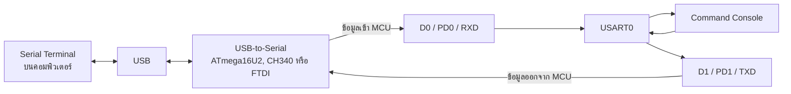
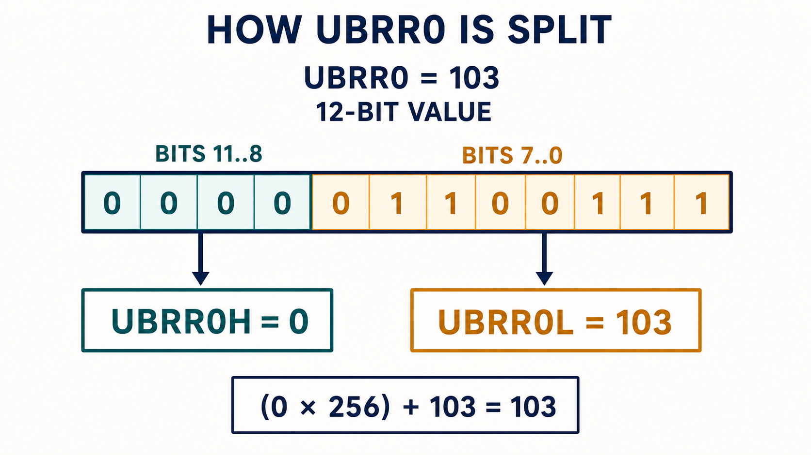
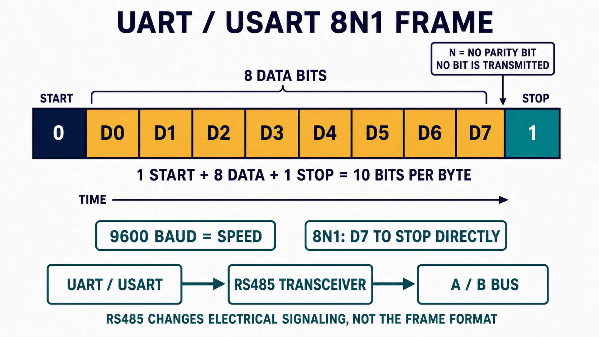
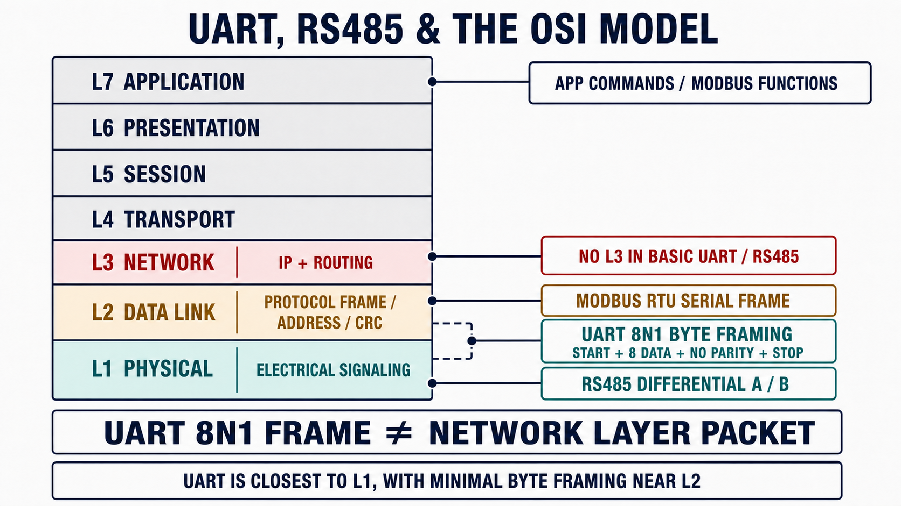

# EP02 - UART/USART: Serial Communication

EP นี้เรียนรู้การสื่อสาร Serial ของ ATmega328P ผ่าน USART0 โดยตรงด้วย
ภาษา C แบบ Register-Level ไม่ใช้ `Serial.begin()`, `Serial.print()`,
`Serial.available()` และ `Serial.read()` ของ Arduino Framework

ตัวอย่างจะสร้าง Command Console ขนาดเล็กสำหรับสั่ง LED บนบอร์ดที่ D13
ผ่าน Serial Terminal โดยใช้ Buffer ขนาดคงที่และไม่ใช้ Dynamic Memory
Allocation

เมื่ออ่านจบ EP นี้ควรตอบได้ว่า:

- UART และ USART ต่างกันอย่างไร
- D0/RX และ D1/TX ของ Arduino Uno เชื่อมกับ USART0 อย่างไร
- ค่า `UBRR0 = 103` สำหรับ 9600 baud มาจากไหน
- `UCSR0A`, `UCSR0B`, `UCSR0C` และ `UDR0` ทำหน้าที่อะไร
- ทำไมต้องรอ `UDRE0` ก่อนเขียนข้อมูลลง `UDR0`
- ทำไมต้องตรวจ `RXC0` ก่อนอ่านข้อมูลจาก `UDR0`
- Frame Format แบบ 8N1 หมายความว่าอะไร
- โปรแกรมแยกคำสั่ง `LED ON`, `LED OFF` และ `STATUS?` อย่างไร

> EP02 หน้านี้เป็นบทเรียนหลักและเรียงหัวข้อตามลำดับวิดีโอ ส่วนคู่มือ WSL,
> การ Flash และ Register พื้นฐานเป็นเอกสารอ้างอิงสำหรับเปิดดูเมื่อจำเป็น

## Chapter 1 — การเชื่อมต่อและผลลัพธ์

EP02 ไม่ต้องต่อ USB-to-Serial Module เพิ่ม เพราะ Arduino Uno มีวงจร
USB-to-Serial เชื่อมกับ USART0 ของ ATmega328P อยู่บนบอร์ดแล้ว

| อุปกรณ์ | การเชื่อมต่อ |
| --- | --- |
| Arduino Uno R3 | ต่อ USB กับคอมพิวเตอร์ |
| LED | ใช้ LED บนบอร์ดที่ D13/PB5 |
| Serial Terminal | เปิด Port ของ Uno ที่ 9600 baud |

ค่าการสื่อสารที่ใช้:

```text
Baud rate:  9600
Data bits:  8
Parity:     None
Stop bits:  1
Mode:       Asynchronous, normal speed
Frame:      8N1
```

หลัง Flash และเปิด Serial Terminal ควรเห็น:

```text
UART command ready
Commands: LED ON, LED OFF, STATUS?
>
```

คำสั่งที่ใช้สาธิต:

```text
LED ON
LED OFF
STATUS?
```

ผลลัพธ์:

```text
> LED ON
LED is ON
> STATUS?
LED status: ON
> LED OFF
LED is OFF
```

> ระหว่าง Upload และเปิด Serial Terminal ไม่ควรต่อวงจรภายนอกที่ D0/RX
> หรือ D1/TX เพราะอาจรบกวน USB-to-Serial และ Uno Bootloader

## Chapter 2 — UART และ USART คืออะไร

UART ย่อมาจาก Universal Asynchronous Receiver/Transmitter เป็นวงจร
Hardware สำหรับรับและส่งข้อมูล Serial แบบไม่มีสัญญาณ Clock แยก

USART ย่อมาจาก Universal Synchronous and Asynchronous
Receiver/Transmitter รองรับทั้งแบบ Synchronous และ Asynchronous

ATmega328P เรียก Peripheral นี้ว่า **USART0** แต่ EP02 ตั้งให้ทำงานใน
Asynchronous Mode จึงมีพฤติกรรมแบบ UART ที่ใช้งานทั่วไป

การสื่อสารเป็นแบบ Full-duplex:

- TX ใช้ส่งข้อมูลออกจาก MCU
- RX ใช้รับข้อมูลเข้า MCU
- TX และ RX สามารถทำงานพร้อมกันได้
- อุปกรณ์ทั้งสองฝั่งต้องใช้ Baud Rate และ Frame Format ตรงกัน

Arduino Framework ซ่อนรายละเอียดเหล่านี้ไว้หลังคำสั่ง:

```cpp
Serial.begin(9600);
Serial.println("Hello");
```

ส่วน EP02 จะกำหนด Baud Rate, Frame Format, Transmitter และ Receiver ผ่าน
Register ของ USART0 โดยตรง

## Chapter 3 — เส้นทาง D0/RX และ D1/TX ไปยัง Serial Terminal

ชื่อขาบน Arduino Uno และชื่อขาของ ATmega328P:

| ขาบน Uno | ขา MCU | หน้าที่ของ USART0 |
| --- | --- | --- |
| D0/RX | `PD0/RXD` | รับข้อมูลจาก USB-to-Serial เข้า ATmega328P |
| D1/TX | `PD1/TXD` | ส่งข้อมูลจาก ATmega328P ไป USB-to-Serial |
| D13 | `PB5` | LED ที่ควบคุมด้วย Command Console |



คำว่า RX และ TX อ้างจากมุมมองของ ATmega328P:

- D0/RX คือข้อมูลที่ MCU รับ
- D1/TX คือข้อมูลที่ MCU ส่ง

USB ไม่ได้เชื่อมกับ USART0 โดยตรง วงจร USB-to-Serial บนบอร์ดทำหน้าที่
แปลงข้อมูล USB ให้เป็นสัญญาณ Serial ที่ D0 และ D1

## Chapter 4 — คำนวณ Baud Rate 9600

### มองภาพรวมก่อนใช้สูตร

`UBRR0` ไม่ใช่ค่า Baud Rate แต่เป็น **เลขที่ใช้บอก Hardware ว่าต้องแบ่ง
Clock ลงกี่เท่า** ก่อนนำไปสร้างจังหวะของ USART

```text
Clock 16 MHz  →  Baud-rate Divider  →  จังหวะสำหรับส่งแต่ละ bit
```

ให้นึกถึง Clock 16 MHz เป็นเครื่องจักรที่หมุนเร็วเกินไป เราจึงต้องใส่
ชุดเฟืองทดความเร็วหรือ Divider เพื่อให้เหลือความเร็วใกล้ 9,600 baud

#### ขั้นที่ 1 — เริ่มจาก Clock ของ Arduino Uno

```text
F_CPU = 16,000,000 Hz
```

หมายความว่า ATmega328P ได้รับ Clock 16,000,000 รอบต่อวินาที

#### ขั้นที่ 2 — Normal Speed ใช้ 16 ticks ต่อหนึ่ง bit

USART ใน Asynchronous Normal Mode ใช้ 16 จังหวะภายในสำหรับข้อมูลหนึ่ง bit
ถ้าต้องการส่ง 9,600 bit ต่อวินาที จึงต้องมีจังหวะภายใน:

```text
9,600 × 16 = 153,600 ticks ต่อวินาที
```

#### ขั้นที่ 3 — หาว่าต้องแบ่ง Clock ลงกี่เท่า

```text
16,000,000 / 153,600 = 104.166...
```

จึงต้องแบ่ง Clock ลงประมาณ 104 เท่า แต่ Hardware ใช้ตัวหารจริงเป็น:

```text
ตัวหารจริง = UBRR0 + 1
```

ถ้าต้องการตัวหาร 104 จึงต้องเขียน:

```text
UBRR0 + 1 = 104
UBRR0     = 103
```

สาเหตุที่มี `+1` เพราะ Counter ของ Hardware เริ่มนับจาก 0 ถึง 103
ซึ่งรวมทั้งหมดเป็น 104 จังหวะ

ลองเปรียบเทียบค่าที่อยู่ใกล้กัน:

| ค่าใน `UBRR0` | ตัวหารจริง | Baud Rate ที่ได้ | Error จาก 9,600 |
| ---: | ---: | ---: | ---: |
| `103` | 104 | 9,615.38 | +0.16% |
| `104` | 105 | 9,523.81 | -0.79% |

ดังนั้นเลือก `UBRR0 = 103` เพราะสร้าง Baud Rate ได้ใกล้ 9,600 มากกว่า

จำเป็นลำดับสั้น ๆ ได้ดังนี้:

```text
ต้องการ 9,600 baud
        ↓ คูณ 16 ticks ต่อ bit
ต้องการ 153,600 ticks ต่อวินาที
        ↓ Clock 16,000,000 หารด้วยค่านี้
ต้องใช้ตัวหารประมาณ 104
        ↓ ตัวหารของ Hardware คือ UBRR0 + 1
จึงเขียน UBRR0 = 103
```

### นำแนวคิดกลับมาเขียนเป็นสูตร

Baud Rate กำหนดความเร็วในการส่งสัญลักษณ์ สำหรับ UART ทั่วไปหนึ่งสัญลักษณ์
แทนหนึ่ง bit จึงมักเรียกเป็น bit per second

ใน Asynchronous Normal Mode ใช้สูตรจาก Datasheet:

```text
UBRR0 = F_CPU / (16 × BAUD) - 1
```

แทนค่า Clock 16 MHz และ Baud Rate 9600:

```text
UBRR0 = 16,000,000 / (16 × 9,600) - 1
      = 103.166...
      เลือกใช้ 103
```

Baud Rate ที่ Hardware สร้างได้จริง:

```text
Actual baud = 16,000,000 / (16 × (103 + 1))
            = 9,615.38 baud

Error       ≈ +0.16%
```

Datasheet แสดงค่าประมาณเป็น Error 0.2% ซึ่งต่ำพอสำหรับการสื่อสาร 9600
baud ในตัวอย่างนี้

Source Code คำนวณค่าด้วย Macro:

```c
#define BAUD_RATE   9600UL
#define UBRR_VALUE  ((F_CPU / (16UL * BAUD_RATE)) - 1UL)
```

`UL` หมายถึง Unsigned Long ช่วยให้การคำนวณทำในขนาดข้อมูลที่รองรับ
16,000,000 โดยไม่ล้นแบบ Integer ขนาดเล็ก

### ทำไมต้องมี `UBRR0H` และ `UBRR0L`

`UBRR0` เป็นค่าตัวเลขขนาด 12 bit แต่ ATmega328P เป็น MCU แบบ 8 bit
จึงไม่สามารถเก็บค่า 12 bit นี้ไว้ใน Hardware Register ขนาด 8 bit
เพียงช่องเดียวได้

Hardware จึงแบ่งค่าเดียวออกเป็นสอง Register:



*ค่า `UBRR0 = 103` เขียนเป็น Binary 12 bit ได้ `0000 0110 0111`
โดย 4 bit ด้านซ้ายส่งไปยัง `UBRR0H` และ 8 bit ด้านขวาส่งไปยัง
`UBRR0L`*

```text
ค่า UBRR0 ขนาด 12 bit

┌─────────────────┬─────────────────────────┐
│ bit 11 ถึง bit 8 │ bit 7 ถึง bit 0          │
│ เก็บใน UBRR0H    │ เก็บใน UBRR0L            │
└─────────────────┴─────────────────────────┘
       4 bit                  8 bit
```

แม้ `UBRR0H` จะเป็น Register ขนาด 8 bit แต่ใช้เก็บค่า UBRR เฉพาะ
4 bit ล่าง ส่วน 4 bit บนไม่ได้ใช้สำหรับค่า Baud-rate Divider

สำหรับ EP02 คำนวณได้ `UBRR_VALUE = 103`

```text
103 ฐานสิบ = 0x067 ฐานสิบหก
           = 0000 0110 0111 ฐานสอง

แบ่งเป็น:

bit 11..8        bit 7........0
┌────────┐       ┌───────────────┐
│  0000  │       │   0110 0111   │
└────────┘       └───────────────┘
 UBRR0H = 0        UBRR0L = 103
```

ค่า 103 ยังไม่เกิน 255 จึงใส่ได้ทั้งหมดใน `UBRR0L` และทำให้
`UBRR0H` มีค่าเป็น 0

Source Code แยกส่วนบนและส่วนล่างดังนี้:

```c
UBRR0H = (uint8_t)(UBRR_VALUE >> 8U);
UBRR0L = (uint8_t)UBRR_VALUE;
```

- `UBRR_VALUE >> 8U` เลื่อน bit ไปทางขวา 8 ตำแหน่ง ตัด 8 bit
  ส่วนล่างออก และเหลือ bit ส่วนบนสำหรับ `UBRR0H`
- `(uint8_t)UBRR_VALUE` เก็บเฉพาะ 8 bit ล่างไว้ใน `UBRR0L`

ตัวอย่าง ถ้าสมมติว่า `UBRR_VALUE = 300`:

```text
300 = 0x12C

UBRR0H = 0x01 = 1
UBRR0L = 0x2C = 44

นำกลับมารวมกัน:
(1 × 256) + 44 = 300
```

> จำสั้น ๆ: `H` ย่อมาจาก High เก็บส่วนบน และ `L` ย่อมาจาก Low
> เก็บ 8 bit ส่วนล่าง สำหรับค่า 103 จะได้ `H = 0` และ `L = 103`

## Chapter 5 — ตั้ง USART0 เป็น 8N1

Register ที่ใช้ตั้งค่า USART0:

| Register | หน้าที่ |
| --- | --- |
| `UBRR0H/L` | กำหนด Baud-rate Divider |
| `UCSR0A` | Status Flag และตัวเลือก Double Speed |
| `UCSR0B` | เปิด Receiver, Transmitter และ Interrupt |
| `UCSR0C` | กำหนด Mode, Parity, Stop bit และ Data bits |
| `UDR0` | Data Register สำหรับส่งหรือรับข้อมูลหนึ่ง byte |

> อ้างอิง: Datasheet DS40002061B หัวข้อ 20.11.2–20.11.4 หน้า 200–203
>
> Datasheet ใช้ชื่อ `UCSRnA`, `UCSRnB` และ `UCSRnC` เพราะ `n`
> หมายถึงหมายเลขของ USART เมื่อใช้ ATmega328P ซึ่งมี USART0 ให้แทน `n`
> ด้วย `0` จึงกลายเป็น `UCSR0A`, `UCSR0B` และ `UCSR0C`

### อย่าจำแค่ตัวอักษร ให้จำคำถามของแต่ละ Register

| Register | ภาพจำ | คำถามที่ตอบ |
| --- | --- | --- |
| `UCSR0A` | แผงไฟสถานะ | ตอนนี้ USART พร้อมหรือเกิดข้อผิดพลาดอะไร และใช้ Double Speed หรือไม่ |
| `UCSR0B` | สวิตช์เปิดระบบ | จะเปิด Receiver, Transmitter หรือ Interrupt ตัวใด |
| `UCSR0C` | ใบกำหนดกติกา | ข้อมูลหนึ่ง Frame ใช้ Mode, Parity, Stop bit และ Data bits แบบใด |

ตัวอักษร A, B และ C ไม่ได้หมายถึงลำดับการทำงานว่า A ต้องทำก่อน B เสมอ
แต่เป็น Register สามกลุ่มที่รับผิดชอบรายละเอียดคนละด้าน

### `UCSR0A` — ดูสถานะและเลือกความเร็ว

```text
bit       7      6       5      4      3      2      1       0
       +------+------+-------+------+------+------+-------+-------+
UCSR0A | RXC0 | TXC0 | UDRE0 | FE0  | DOR0 | UPE0 | U2X0  | MPCM0 |
       +------+------+-------+------+------+------+-------+-------+
         <----------- Status Flag ----------->  <- ตัวเลือก Mode ->
```

| Bit | เมื่อมีค่าเป็น 1 หมายความว่า |
| --- | --- |
| `RXC0` | มีข้อมูลที่รับมาแล้วและยังไม่ได้อ่านอยู่ใน Receive Buffer |
| `TXC0` | ส่งครบทั้ง Frame แล้ว รวมถึง Stop bit |
| `UDRE0` | ช่องรับข้อมูลสำหรับส่งว่างแล้ว สามารถเขียน byte ใหม่ลง `UDR0` ได้ |
| `FE0` | พบ Frame Error เพราะ Stop bit ที่รับมาไม่เป็น Logic 1 |
| `DOR0` | เกิด Data OverRun เพราะข้อมูลใหม่เข้ามาขณะ Receive Buffer ยังเต็ม |
| `UPE0` | พบ Parity Error เมื่อเปิดใช้ Parity |
| `U2X0` | ใช้ Double Speed ใน Asynchronous Mode โดยลดตัวหารจาก 16 เหลือ 8 |
| `MPCM0` | เปิด Multi-processor Communication Mode |

ดังนั้นคำว่า Status Flag หมายถึง Bit ที่ Hardware เปลี่ยนค่าเพื่อรายงานสถานะ
ให้ Program อ่าน ไม่ใช่ค่าที่ Program ต้องคอยเขียนเองทั้งหมด ตัวอย่างเช่น:

```c
while ((UCSR0A & (1U << UDRE0)) == 0U){
    /* รอจน Hardware แจ้งว่าพร้อมรับ byte ถัดไป */
}
```

บรรทัดนี้ไม่ได้ถามว่า `UCSR0A` ทั้ง Register เท่ากับเท่าไร แต่ Mask
เพื่อดูเฉพาะ `UDRE0`

อีกจุดที่สำคัญคือ:

```c
UCSR0A = 0U;
```

ไม่ได้หมายความว่าอ่าน `UCSR0A` กลับมาแล้วทุก Bit จะเป็น 0 ตลอดเวลา
บรรทัดนี้เลือก `U2X0 = 0` และ `MPCM0 = 0` ส่วน Status Flag จะเปลี่ยนตาม
Hardware เช่น `UDRE0` มีค่าเริ่มต้นเป็น 1 เพราะ Transmit Buffer พร้อมรับข้อมูล

> Register บาง Bit มีกฎการเขียนพิเศษ เช่น `TXC0` ล้าง Flag ด้วยการเขียน 1
> จึงควรอ่านคำอธิบาย Read/Write ของแต่ละ Bit ใน Datasheet ไม่ควรสรุปว่า
> การเขียน 1 หมายถึง “เปิด” สำหรับทุก Register

### `UCSR0B` — เปิดส่วนที่จะใช้งาน

```text
bit        7       6       5      4      3       2      1      0
       +-------+-------+-------+------+------+-------+------+------+
UCSR0B | RXCIE0| TXCIE0| UDRIE0| RXEN0| TXEN0| UCSZ02| RXB80| TXB80|
       +-------+-------+-------+------+------+-------+------+------+
         <--- Interrupt --->    <- RX/TX ->  < Character/9th bit >
```

| กลุ่ม Bit | หน้าที่ | ค่าใน EP02 |
| --- | --- | --- |
| `RXCIE0`, `TXCIE0`, `UDRIE0` | เปิด Interrupt เมื่อรับเสร็จ ส่งเสร็จ หรือช่องส่งว่าง | `0` เพราะใช้ Polling |
| `RXEN0` | เปิดวงจร Receiver และให้ USART ควบคุมขา RX | `1` |
| `TXEN0` | เปิดวงจร Transmitter และให้ USART ควบคุมขา TX | `1` |
| `UCSZ02` | Bit บนของตัวเลือก Character Size | `0`; ต้องรวมกับ `UCSZ01:0 = 11` จึงแปลว่า 8 bit |
| `RXB80` | Data bit ที่ 9 ของข้อมูลที่รับ เป็น Bit แบบอ่านอย่างเดียว | ไม่ใช้ใน Frame 8-bit |
| `TXB80` | Data bit ที่ 9 ของข้อมูลที่จะส่ง | เป็น `0` และไม่ใช้ใน Frame 8-bit |

คำสั่งใน EP02 ตั้งเพียง `RXEN0` และ `TXEN0`:

```text
(1 << RXEN0) = 0001 0000
(1 << TXEN0) = 0000 1000
OR รวมกัน      = 0001 1000 = 0x18
```

```c
UCSR0B = (1U << RXEN0) | (1U << TXEN0);
```

จึงแปลตรงตัวว่า “เปิดรับและเปิดส่ง ส่วน Interrupt ยังไม่เปิด”

การใช้ `=` หมายถึงเขียนค่าทั้ง Register ดังนั้น Control Bit อื่นที่ไม่ได้อยู่
ด้านขวาจะได้รับค่า 0 แต่ไม่ได้หมายความว่า Program สามารถบังคับ Bit แบบ
Read-only อย่าง `RXB80` ให้เป็น 0 ได้

### `UCSR0C` — กำหนดกติกาของ Frame

```text
bit         7        6       5      4      3       2       1       0
       +--------+--------+------+------+-------+-------+-------+-------+
UCSR0C | UMSEL01| UMSEL00| UPM01| UPM00| USBS0 | UCSZ01| UCSZ00| UCPOL0|
       +--------+--------+------+------+-------+-------+-------+-------+
         <- Mode ->       <-Parity-> Stop bit  <- Data bits ->  Clock
```

สำหรับ Asynchronous 8N1 ต้องการค่า:

| กลุ่ม Bit | ค่า | ความหมาย |
| --- | --- | --- |
| `UMSEL01:0` | `00` | Asynchronous USART |
| `UPM01:0` | `00` | ปิด Parity จึงไม่มี Parity bit ถูกส่งใน Frame |
| `USBS0` | `0` | ส่ง 1 Stop bit |
| `UCSZ02:0` | `011` | ใช้ข้อมูล 8 bit โดย `UCSZ02` อยู่ใน `UCSR0B` |
| `UCPOL0` | `0` | ไม่ใช้ใน Asynchronous Mode |

มีเพียง `UCSZ01` และ `UCSZ00` ที่ต้องเป็น 1:

```text
(1 << UCSZ01) = 0000 0100
(1 << UCSZ00) = 0000 0010
OR รวมกัน       = 0000 0110 = 0x06
```

```c
UCSR0C = (1U << UCSZ01) | (1U << UCSZ00);
```

Bit อื่นเป็น 0 เพราะการ Assignment ด้วย `=` เขียนค่าทั้ง 8 bit ลง Register
ผลลัพธ์จึงเป็น Asynchronous, No parity, 1 Stop bit และ 8 Data bits

### ทั้งสาม Register ทำงานร่วมกันอย่างไร

```text
การส่ง:
การตั้งค่า: UCSR0B เปิด TX + UCSR0C กำหนด Frame + UBRR0/U2X0 กำหนดความเร็ว
เส้นทางข้อมูล: CPU -> UDR0 -> USART Transmitter -> ขา TX
สถานะย้อนกลับ: UCSR0A รายงาน UDRE0 และ TXC0 ให้ CPU

การรับ:
การตั้งค่า: UCSR0B เปิด RX + UCSR0C กำหนด Frame + UBRR0/U2X0 กำหนดความเร็ว
เส้นทางข้อมูล: ขา RX -> USART Receiver -> UDR0 -> CPU
สถานะย้อนกลับ: UCSR0A รายงาน RXC0, FE0, DOR0 หรือ UPE0 ให้ CPU
```

สรุปสั้นที่สุด:

```text
UBRR0 + U2X0 กำหนด Baud Rate
UCSR0A         รายงานสถานะและมีตัวเลือก U2X0/MPCM0
UCSR0B         เปิดวงจรและ Interrupt ที่จะใช้งาน
UCSR0C         กำหนดรูปแบบ Frame
UDR0           ถือข้อมูลหนึ่ง byte ที่กำลังส่งหรือรับ
```

ฟังก์ชันตั้งค่าที่ใช้ใน EP02:

```c
static void uart_init(void){
    UBRR0H = (uint8_t)(UBRR_VALUE >> 8U);
    UBRR0L = (uint8_t)UBRR_VALUE;

    UCSR0A = 0U;
    UCSR0B = (1U << RXEN0) | (1U << TXEN0);
    UCSR0C = (1U << UCSZ01) | (1U << UCSZ00);
}
```

### ใช้ Asynchronous Normal Speed

```c
UCSR0A = 0U;
```

- `U2X0 = 0` ใช้ Normal Speed และตัวหาร 16
- `MPCM0 = 0` ไม่ใช้ Multi-processor Communication Mode

### เปิด Receiver และ Transmitter

```c
UCSR0B = (1U << RXEN0) | (1U << TXEN0);
```

| Bit | ค่า | ผลลัพธ์ |
| --- | --- | --- |
| `RXEN0` | 1 | เปิด Receiver |
| `TXEN0` | 1 | เปิด Transmitter |
| USART Interrupt bits | 0 | ใช้ Polling ใน EP02 |
| `UCSZ02` | 0 | ทำงานร่วมกับ `UCSZ01:0` เพื่อเลือกข้อมูล 8 bit |

### รวม `UCSR0B` และ `UCSR0C` เป็น Frame Format แบบ 8N1

จุดสำคัญคือ Frame Format ไม่ได้มาจากบรรทัด `UCSR0C` เพียงบรรทัดเดียว
เพราะ `UCSZ02` ซึ่งเป็น Bit บนของ Character Size อยู่ใน `UCSR0B`:

```c
UCSR0B = (1U << RXEN0) | (1U << TXEN0);
UCSR0C = (1U << UCSZ01) | (1U << UCSZ00);
```

| ส่วนของ Frame | Bit และ Register | ค่านี้เกิดจาก Code อย่างไร | ผลลัพธ์ |
| --- | --- | --- | --- |
| Mode | `UMSEL01:0` ใน `UCSR0C` | ไม่ได้ Set bit 7:6 จึงเป็น `00` | Asynchronous USART |
| Data bits | `UCSZ02` ใน `UCSR0B` + `UCSZ01:0` ใน `UCSR0C` | `UCSZ02 = 0` และ Set `UCSZ01:0 = 11` รวมเป็น `011` | 8 data bits |
| Parity | `UPM01:0` ใน `UCSR0C` | ไม่ได้ Set bit 5:4 จึงเป็น `00` | None |
| Stop bit | `USBS0` ใน `UCSR0C` | ไม่ได้ Set bit 3 จึงเป็น `0` | 1 stop bit |

มองเป็นค่าของ Register จะได้:

```text
UCSR0B = 0001 1000
bit 4: RXEN0  = 1
bit 3: TXEN0  = 1
bit 2: UCSZ02 = 0

UCSR0C = 0000 0110
bit 2: UCSZ01 = 1
bit 1: UCSZ00 = 1

Character Size = UCSZ02:0 = 0 11 = 8 data bits
```

ดังนั้น Code และตารางกำลังแสดงคนละมุม:

- Code แสดงเฉพาะ Bit ที่ต้องเขียนเป็น 1
- Assignment ด้วย `=` ทำให้ Writable Bit อื่นเป็น 0
- ตารางแสดงค่าผลลัพธ์สุดท้ายหลังรวม Bit จากทั้ง `UCSR0B` และ `UCSR0C`

ไม่จำเป็นต้องเขียน `(0U << USBS0)` หรือ `(0U << UPM00)` ลงใน Code
เพราะเลื่อนค่า 0 ไปกี่ตำแหน่งก็ยังได้ 0 และนำไป OR แล้วไม่เปลี่ยนผลลัพธ์
จึงเขียนเฉพาะ Bit ที่ต้องเป็น 1 และอธิบายค่า 0 ที่เกิดขึ้นในตาราง

8N1 จึงหมายถึง:

```text
8 data bits + No parity + 1 stop bit
```

Hardware ยังเพิ่ม Start bit ให้อัตโนมัติทุก Frame



*8N1 กำหนดรูปแบบของข้อมูลหนึ่ง Frame ส่วน Baud Rate กำหนดความเร็ว
และ RS485 Transceiver เปลี่ยนสัญญาณ Logic เป็นสัญญาณ Differential
บนสาย A/B*

#### 8N1 ตั้งเพื่ออะไร

8N1 ทำให้ Transmitter และ Receiver ตกลงกันว่า ข้อมูลหนึ่ง Frame เริ่มตรงไหน
มีกี่ bit และจบตรงไหน:

```text
Start 1 bit + Data 8 bit + Stop 1 bit = 10 transmitted bits
Parity = None (no bit transmitted)
```

แม้ชื่อ 8N1 จะไม่ได้เขียน Start bit ไว้ แต่ Hardware จะเพิ่มให้อัตโนมัติ
จึงใช้ทั้งหมด 10 bit สำหรับส่งข้อมูลหนึ่ง byte:

| ส่วน | จำนวน | หน้าที่ |
| --- | ---: | --- |
| Start | 1 bit | เปลี่ยนจาก Idle 1 เป็น 0 เพื่อแจ้งว่า Frame เริ่มแล้ว |
| Data | 8 bit | ส่งค่าข้อมูล `D0` ถึง `D7` โดยเริ่มจาก `D0` |
| Parity | ไม่มี bit ถูกส่ง | `N` หมายถึงไม่สร้างและไม่ส่ง Parity bit |
| Stop | 1 bit | กลับเป็น Logic 1 เพื่อจบ Frame และเตรียม Frame ถัดไป |

> **No Parity ไม่ได้หมายถึงส่ง Parity bit ที่มีค่า 0** แต่หมายถึงไม่มี
> Parity bit และไม่มี Bit Time สำหรับ Parity อยู่ใน Frame เลย สำหรับ 8N1
> หลังส่ง `D7` แล้ว Hardware จะส่ง Stop bit ต่อทันที

เปรียบเทียบตำแหน่งของ Parity:

```text
8N1:  Start → D0 ... D7 → Stop
                    ไม่มี Parity bit

8E1:  Start → D0 ... D7 → Even Parity → Stop
8O1:  Start → D0 ... D7 → Odd Parity  → Stop
```

Parity bit จึงอยู่ระหว่าง `D7` กับ Stop bit เฉพาะเมื่อเลือก Even หรือ Odd
Parity เท่านั้น

ดังนั้น `9600` และ `8N1` จึงตอบคนละคำถาม:

```text
9600 baud = ส่งแต่ละ bit เร็วเท่าไร
8N1       = ข้อมูลหนึ่ง Frame มีรูปแบบอย่างไร
```

ที่ 9600 baud แบบ 8N1 หนึ่ง byte ใช้ 10 bit จึงส่งได้สูงสุดประมาณ
`9600 / 10 = 960 bytes ต่อวินาที` โดยยังไม่รวมช่วงว่างระหว่างข้อมูล

#### เชื่อมโยงกับ RS485

หากเคยกำหนดค่า `9600 8N1` ให้กับอุปกรณ์ RS485 ค่าดังกล่าวไม่ได้มาจาก
มาตรฐาน RS485 โดยตรง แต่เป็นการตั้งค่า UART/USART ที่ใช้สร้าง Bit Stream
ก่อนส่งเข้าสู่ RS485 Transceiver

```text
UART/USART Frame → RS485 Transceiver → Differential Signal บนสาย A/B
```

RS485 Transceiver ไม่ได้รู้ว่า bit ใดเป็น Start, Data หรือ Stop แต่ทำหน้าที่
แปลงระดับ Logic TX/RX เป็นแรงดัน Differential บนสาย A/B และแปลงกลับ
เท่านั้น การสร้างและตีความ Frame ยังคงเป็นหน้าที่ของ UART/USART

RS485 จึงไม่ได้บังคับว่าทุกระบบต้องใช้ 8N1 อุปกรณ์บางระบบอาจใช้ 8E1,
8O1 หรือ 8N2 ได้ ต้องตั้ง Baud Rate และ Frame Format ของอุปกรณ์ทั้งสองฝั่ง
ให้ตรงตามคู่มือของระบบนั้น

#### UART Frame เกี่ยวข้องกับ Network Layer หรือไม่



*UART อยู่ใกล้ Physical Layer มากที่สุด โดยมี Byte Framing แบบพื้นฐาน
อยู่บริเวณรอยต่อ L1/L2 ส่วน Network Layer หรือ L3 ต้องมีแนวคิดอย่าง IP
และ Routing ซึ่งไม่มีใน UART/RS485 พื้นฐาน*

คำตอบสั้น ๆ คือ **ไม่เกี่ยวข้องโดยตรง** คำว่า Frame ถูกใช้ในหลายบริบท
แต่ไม่ได้หมายความว่าทุก Frame เป็นข้อมูลของ Network Layer

| คำที่พบ | สิ่งที่ครอบอยู่ | หน้าที่ | ใกล้กับ OSI Layer |
| --- | --- | --- | --- |
| UART 8N1 Frame | ข้อมูลหนึ่ง byte | จัด Start, Data และ Stop โดย 8N1 ไม่มี Parity bit | รอยต่อ L1/L2 |
| Data-link/Protocol Frame | ข้อมูลหลาย byte | เพิ่ม Address, Control หรือ CRC สำหรับ Link เดียวกัน | L2 |
| IP Packet | ข้อมูลสำหรับส่งข้าม Network | มี Source/Destination IP และใช้ Routing | L3 |

ในศัพท์ของ OSI โดยทั่วไป:

- Layer 2 เรียกหน่วยข้อมูลว่า **Frame**
- Layer 3 เรียกหน่วยข้อมูลว่า **Packet**
- แต่คำว่า UART Frame หมายถึงรูปแบบ Bit ของข้อมูลหนึ่ง byte ไม่ใช่
  Layer 2 Frame แบบ Ethernet และไม่ใช่ Layer 3 Packet

UART ไม่เข้ากับ OSI เพียง Layer เดียวอย่างสมบูรณ์ เพราะ UART ถูกสร้างมา
สำหรับการสื่อสาร Serial ไม่ใช่ Network Stack แบบเต็ม หากต้องวางโดยประมาณ:

- การเปลี่ยน byte เป็น Bit Stream และส่งผ่าน TX/RX อยู่ใกล้ L1
- Start, Data, Parity และ Stop เป็น Byte Framing ขั้นพื้นฐานใกล้รอยต่อ L1/L2
- UART ไม่มี Addressing, Routing หรือ CRC สำหรับข้อมูลทั้ง Packet
- ดังนั้น UART ไม่ใช่ Network Layer

ตัวอย่างจาก EP02:

```text
"LED ON"                         Application Data
    ↓ แยกเป็นแต่ละ byte
'L'  'E'  'D'  ' '  'O'  'N'
    ↓ UART ครอบแต่ละ byte แยกกัน
Start + 8 Data + Stop            UART 8N1 Frame
    ↓
TX/RX Logic หรือ RS485 A/B       Physical Signal
```

หากใช้ Modbus RTU ผ่าน RS485 จะเห็นหลาย Layer ซ้อนกัน:

```text
Modbus Function และ Data Model   Application
Address + Function + Data + CRC  Modbus RTU Serial Frame
Start + Data + Parity + Stop     UART Byte Framing
Differential Voltage A/B         RS485 Physical Layer
```

ในระบบนี้ยังไม่มี Network Layer L3 เพราะไม่มี IP และไม่มี Router
Device Address ของ Modbus ช่วยเลือกอุปกรณ์บน Bus แต่ไม่ได้ทำให้ Modbus RTU
กลายเป็น IP Network

## Chapter 6 — ส่งข้อความผ่าน USART0

ก่อนเขียน byte ใหม่ต้องรอให้ USART Data Register พร้อม:

```c
while ((UCSR0A & (1U << UDRE0)) == 0U){
    /* รอให้ Transmit Register พร้อม */
}
UDR0 = (uint8_t)character;
```

`UDRE0` ย่อมาจาก USART Data Register Empty:

- `UDRE0 = 0` หมายถึง Buffer สำหรับส่งยังไม่พร้อมรับ byte ใหม่
- `UDRE0 = 1` หมายถึงเขียน byte ใหม่ลง `UDR0` ได้
- เมื่อเขียน `UDR0` แล้ว Hardware จะเลื่อน bit ออกทาง TXD อัตโนมัติ

`UDRE0` ไม่เหมือน `TXC0`:

- `UDRE0` บอกว่า Data Register พร้อมรับ byte ถัดไป
- `TXC0` บอกว่า Frame ทั้งหมดส่งออกจาก Shift Register เสร็จแล้ว

ฟังก์ชันส่งหนึ่งตัวอักษร:

```c
static void uart_putchar(char character){
    if (character == '\n'){
        while ((UCSR0A & (1U << UDRE0)) == 0U){
        }
        UDR0 = (uint8_t)'\r';
    }

    while ((UCSR0A & (1U << UDRE0)) == 0U){
    }
    UDR0 = (uint8_t)character;
}
```

เมื่อพบ `\n` โปรแกรมส่ง `\r` ก่อน แล้วจึงส่ง `\n` ทำให้ Terminal ได้
Line Ending แบบ CRLF และขึ้นบรรทัดใหม่ได้ถูกต้อง

ฟังก์ชันส่งข้อความ:

```c
static void uart_puts(const char *text){
    while (*text != '\0'){
        uart_putchar(*text);
        text++;
    }
}
```

C String จบด้วย Null Terminator `\0` ฟังก์ชันจึงส่งทีละตัวอักษรจนพบ
ตำแหน่งสิ้นสุด โดยไม่ต้องใช้ Arduino `String`

## Chapter 7 — รับข้อมูลผ่าน USART0

ตรวจว่ามีข้อมูลเข้ามาหรือยัง:

```c
static bool uart_rx_ready(void){
    return (UCSR0A & (1U << RXC0)) != 0U;
}
```

`RXC0` ย่อมาจาก USART Receive Complete:

- `RXC0 = 0` ยังไม่มี byte ใหม่ให้อ่าน
- `RXC0 = 1` มีข้อมูลที่ยังไม่ได้อ่านอยู่ใน Receive Buffer

อ่านข้อมูลหนึ่ง byte:

```c
static char uart_getchar(void){
    return (char)UDR0;
}
```

การอ่าน `UDR0` จะนำ byte ที่รับแล้วออกจาก Receive Buffer จากนั้น Hardware
จะจัดการสถานะ `RXC0` ตามข้อมูลที่ยังเหลืออยู่

### Polling ใน EP02 คืออะไร

Polling ในที่นี้หมายถึง CPU อ่าน Status Flag ภายใน `UCSR0A` ซ้ำ ๆ
ไม่ใช่การส่งข้อความถามอุปกรณ์อีกฝั่งผ่านสาย UART

EP02 ใช้ Polling สองรูปแบบ:

| งาน | Status Flag | รูปแบบใน Code | ผลต่อ CPU |
| --- | --- | --- | --- |
| ส่งข้อมูล | `UDRE0` | `while` ตรวจซ้ำจนเป็น 1 | Blocking: CPU รออยู่ตรงนั้น |
| รับข้อมูล | `RXC0` | `if` ตรวจหนึ่งครั้งในแต่ละรอบของ Main Loop | Non-blocking: ถ้ายังไม่มีข้อมูลจะไปทำรอบถัดไป |

ตัวอย่าง Polling ฝั่งรับ:

```c
if (uart_rx_ready()){
    const char received = uart_getchar();
}
```

Interrupt Enable ได้แก่ `RXCIE0`, `TXCIE0` และ `UDRIE0` จึงเป็น 0
ใน EP02 ข้อดีของ Polling คือเห็นลำดับ Register ชัดและ Code เริ่มต้นง่าย
ข้อแลกเปลี่ยนคือ CPU ต้องกลับมาตรวจ Flag เอง โดยการส่งจะหยุดรอ `UDRE0`
ส่วนการรับต้องกลับมาตรวจ `RXC0` ใน Main Loop บ่อย ๆ ตัวอย่างนี้ยังไม่ตรวจ
Framing Error, Data OverRun หรือ Parity Error

## Chapter 8 — สร้าง Command Console

โปรแกรมเก็บอักขระใน Buffer:

```c
#define COMMAND_CAPACITY 16U

char command[COMMAND_CAPACITY];
uint8_t length = 0U;
```

Buffer 16 byte เก็บคำสั่งได้สูงสุด 15 ตัวอักษร อีกหนึ่ง byte สงวนไว้สำหรับ
Null Terminator `\0`

ลำดับการรับคำสั่ง:

```text
รับหนึ่ง byte
  -> ถ้าเป็น CR ให้ข้าม
  -> ถ้าเป็น LF ให้ปิดท้าย String ด้วย \0
  -> นำ String ไปเทียบกับคำสั่ง
  -> ถ้าเป็นตัวอักษรทั่วไปให้เก็บลง Buffer
  -> ถ้า Buffer เต็มให้ล้าง Buffer และแจ้ง Command too long
```

โปรแกรมรองรับ LF และ CRLF:

- LF ใช้จบคำสั่ง
- CR ใน CRLF ถูกข้าม
- ถ้า Terminal ส่งเฉพาะ CR โปรแกรมจะยังไม่ประมวลผลคำสั่ง

คำสั่งต้องตรงทั้งตัวพิมพ์ใหญ่และช่องว่าง:

| คำสั่ง | การทำงาน | ข้อความตอบกลับ |
| --- | --- | --- |
| `LED ON` | Set `PORTB5` เป็น 1 | `LED is ON` |
| `LED OFF` | Clear `PORTB5` เป็น 0 | `LED is OFF` |
| `STATUS?` | อ่าน Output Latch ที่ `PORTB5` | `LED status: ON/OFF` |
| ค่าอื่น | ไม่เปลี่ยน LED | `Unknown command` |

ฟังก์ชัน `text_equal()` เปรียบเทียบ C String ทีละตัวอักษร:

```c
static bool text_equal(const char *left, const char *right){
    while ((*left != '\0') && (*right != '\0')){
        if (*left != *right){
            return false;
        }
        left++;
        right++;
    }

    return *left == *right;
}
```

Command Handler ควบคุม LED ที่ D13/PB5:

```c
if (text_equal(command, "LED ON")){
    PORTB |= (1U << PORTB5);
    uart_puts("LED is ON\n");
} else if (text_equal(command, "LED OFF")){
    PORTB &= ~(1U << PORTB5);
    uart_puts("LED is OFF\n");
}
```

ก่อนเริ่ม Console โปรแกรมกำหนด D13 เป็น Output และปิด LED:

```c
DDRB |= (1U << DDB5);
PORTB &= ~(1U << PORTB5);
```

## Chapter 9 — โค้ดฉบับเต็ม

```c
#include <avr/io.h>
#include <stdbool.h>
#include <stdint.h>

#ifndef F_CPU
#define F_CPU 16000000UL
#endif

#define BAUD_RATE   9600UL
#define UBRR_VALUE  ((F_CPU / (16UL * BAUD_RATE)) - 1UL)
#define COMMAND_CAPACITY 16U

static void uart_init(void){
    UBRR0H = (uint8_t)(UBRR_VALUE >> 8U);
    UBRR0L = (uint8_t)UBRR_VALUE;

    UCSR0A = 0U; /* ใช้ความเร็วปกติ ไม่เปิด U2X Mode */
    UCSR0B = (1U << RXEN0) | (1U << TXEN0);
    UCSR0C = (1U << UCSZ01) | (1U << UCSZ00); /* 8N1. */
}

static void uart_putchar(char character){
    if (character == '\n'){
        while ((UCSR0A & (1U << UDRE0)) == 0U){
            /* รอให้ Transmit Register พร้อม */
        }
        UDR0 = (uint8_t)'\r';
    }

    while ((UCSR0A & (1U << UDRE0)) == 0U){
        /* รอให้ Transmit Register พร้อม */
    }
    UDR0 = (uint8_t)character;
}

static void uart_puts(const char *text){
    while (*text != '\0'){
        uart_putchar(*text);
        text++;
    }
}

static bool uart_rx_ready(void){
    return (UCSR0A & (1U << RXC0)) != 0U;
}

static char uart_getchar(void){
    return (char)UDR0;
}

static bool text_equal(const char *left, const char *right){
    while ((*left != '\0') && (*right != '\0')){
        if (*left != *right){
            return false;
        }
        left++;
        right++;
    }

    return *left == *right;
}

static void handle_command(const char *command){
    if (text_equal(command, "LED ON")){
        PORTB |= (1U << PORTB5);
        uart_puts("LED is ON\n");
    } else if (text_equal(command, "LED OFF")){
        PORTB &= ~(1U << PORTB5);
        uart_puts("LED is OFF\n");
    } else if (text_equal(command, "STATUS?")){
        if ((PORTB & (1U << PORTB5)) != 0U){
            uart_puts("LED status: ON\n");
        } else{
            uart_puts("LED status: OFF\n");
        }
    } else if (*command != '\0'){
        uart_puts("Unknown command\n");
    }
}

int main(void){
    char command[COMMAND_CAPACITY];
    uint8_t length = 0U;

    DDRB |= (1U << DDB5);
    PORTB &= ~(1U << PORTB5);
    uart_init();

    uart_puts("UART command ready\n");
    uart_puts("Commands: LED ON, LED OFF, STATUS?\n> ");

    while (1){
        if (uart_rx_ready()){
            const char received = uart_getchar();

            if (received == '\r'){
                continue;
            }

            if (received == '\n'){
                command[length] = '\0';
                handle_command(command);
                length = 0U;
                uart_puts("> ");
            } else if (length < (COMMAND_CAPACITY - 1U)){
                command[length] = received;
                length++;
            } else{
                length = 0U;
                uart_puts("\nCommand too long\n> ");
            }
        }
    }
}
```

ซอร์สที่ใช้ Build จริง: [src/main.c](src/main.c)

### อ่าน `main()` ทีละช่วง

`main()` คือ Entry Point ที่ C Runtime เรียกหลัง MCU Reset คำว่า `void`
หมายถึงฟังก์ชันนี้ไม่รับ Argument ส่วน Return Type เป็น `int` ตามรูปแบบของ
ภาษา C แต่ Firmware นี้จะไม่เดินทางไปถึง `return` เพราะทำงานอยู่ใน
Infinite Loop ตลอดเวลา

#### 1. สร้าง Buffer และตัวแปรบอกตำแหน่ง

```c
char command[COMMAND_CAPACITY];
uint8_t length = 0U;
```

- `command` คือ Array ใน SRAM สำหรับสะสมอักขระที่รับจาก UART
- `COMMAND_CAPACITY` มีค่า 16 จึงมีตำแหน่ง `command[0]` ถึง `command[15]`
- `length` ไม่ใช่ขนาดของ Array หรือ Pointer แต่เป็น Index ของตำแหน่งว่างถัดไป
- `0U` คือเลขศูนย์ชนิด Unsigned และทำให้เริ่มเขียนที่ `command[0]`

ตอนเริ่มต้น `command` ยังไม่ถือเป็น C String ที่พร้อมใช้งาน เพราะยังไม่มี
Null Terminator `\0` โปรแกรมจะเติมให้เมื่อรับ LF ซึ่งเป็นจุดจบคำสั่ง

#### 2. เตรียม LED และ USART0

```c
DDRB |= (1U << DDB5);
PORTB &= ~(1U << PORTB5);
uart_init();
```

- บรรทัดแรก Set `DDB5` เป็น 1 เพื่อกำหนด PB5 หรือ D13 เป็น Output
- บรรทัดที่สอง Clear `PORTB5` เป็น 0 เพื่อให้ LED เริ่มต้นในสถานะปิด
- `uart_init()` ตั้ง Baud Rate 9600, Frame Format 8N1 และเปิด RX/TX

#### 3. ส่งข้อความเริ่มต้น

```c
uart_puts("UART command ready\n");
uart_puts("Commands: LED ON, LED OFF, STATUS?\n> ");
```

ข้อความแรกแจ้งว่า Firmware พร้อม ส่วนข้อความที่สองแสดงรายการคำสั่งและ
เครื่องหมาย `> ` ซึ่งทำหน้าที่เป็น Prompt บอกผู้ใช้ว่าสามารถพิมพ์คำสั่งได้

#### 4. วนตรวจข้อมูลด้วย Polling

```c
while (1){
    if (uart_rx_ready()){
        const char received = uart_getchar();
```

- `while (1)` เป็น Infinite Loop เพราะ Embedded Firmware ต้องทำงานต่อเนื่อง
- `uart_rx_ready()` ตรวจ `RXC0`; ถ้ายังไม่มีข้อมูล เงื่อนไขเป็น False
  แล้วเริ่ม Loop รอบใหม่
- เมื่อมีข้อมูล `uart_getchar()` จะอ่านหนึ่ง byte จาก `UDR0`
- `received` เป็นตัวแปรชั่วคราวสำหรับ byte นั้น ส่วน `const` ป้องกันไม่ให้
  Code ในรอบเดียวกันเปลี่ยนค่าที่อ่านมาโดยไม่ตั้งใจ

#### 5. แยก CR และ LF

```c
if (received == '\r'){
    continue;
}
```

`\r` คือ Carriage Return หรือ CR หาก Terminal ส่ง Enter แบบ CRLF
โปรแกรมจะได้รับ `\r` ก่อนแล้วจึงได้รับ `\n` บรรทัด `continue` จะข้าม Code
ที่เหลือในรอบปัจจุบันและกลับไปเริ่ม `while (1)` รอบใหม่เพื่อรอ byte ถัดไป

```c
if (received == '\n'){
    command[length] = '\0';
    handle_command(command);
    length = 0U;
    uart_puts("> ");
}
```

`\n` คือ Line Feed หรือ LF และถูกใช้เป็นเครื่องหมายจบคำสั่ง:

1. เขียน `\0` ที่ตำแหน่งว่างถัดไปเพื่อเปลี่ยนข้อมูลใน Buffer ให้เป็น C String
2. ส่ง String ไปให้ `handle_command()` เปรียบเทียบกับคำสั่งที่รองรับ
3. Reset `length` เป็น 0 เพื่อใช้ Buffer รับคำสั่งรอบใหม่
4. แสดง Prompt `> ` อีกครั้ง

#### 6. เก็บอักขระทั่วไปโดยไม่ให้ Buffer ล้น

```c
else if (length < (COMMAND_CAPACITY - 1U)){
    command[length] = received;
    length++;
}
```

`COMMAND_CAPACITY - 1U` เท่ากับ 15 โปรแกรมจึงอนุญาตให้เก็บอักขระใน
ตำแหน่ง 0 ถึง 14 รวม 15 ตัว และสงวน `command[15]` ไว้สำหรับ `\0`

ลำดับของสองบรรทัดใน Block นี้สำคัญ:

```text
command[length] = received;  เก็บอักขระในตำแหน่งว่างปัจจุบัน
length++;                    เลื่อนไปยังตำแหน่งว่างถัดไป
```

#### 7. จัดการคำสั่งที่ยาวเกิน Buffer

```c
else{
    length = 0U;
    uart_puts("\nCommand too long\n> ");
}
```

เมื่อมีอักขระตัวที่ 16 เข้ามาก่อน LF เงื่อนไขพื้นที่ว่างจะเป็น False โปรแกรม
จึงล้างความยาวของคำสั่งปัจจุบันและแจ้ง Error โดยไม่เขียนเกินขอบเขต Array

> ตัวอย่างนี้เป็น Console แบบเริ่มต้น หลังเกิด `Command too long` อักขระที่
> ตามมาก่อน LF สามารถถูกเก็บเป็นคำสั่งใหม่ได้ หากต้องการ Parser ที่เข้มงวด
> ควรเพิ่มสถานะสำหรับทิ้งอักขระทั้งหมดจนกว่าจะพบ LF

### ตัวอย่างเมื่อพิมพ์ `LED ON` แล้วกด Enter

| Byte ที่รับ | การทำงาน | ค่า `length` หลังทำงาน | ข้อมูลที่สะสม |
| --- | --- | ---: | --- |
| `L` | เก็บที่ `command[0]` | 1 | `L` |
| `E` | เก็บที่ `command[1]` | 2 | `LE` |
| `D` | เก็บที่ `command[2]` | 3 | `LED` |
| Space | เก็บที่ `command[3]` | 4 | `LED ` |
| `O` | เก็บที่ `command[4]` | 5 | `LED O` |
| `N` | เก็บที่ `command[5]` | 6 | `LED ON` |
| CR | ข้ามด้วย `continue` | 6 | `LED ON` |
| LF | เขียน `\0` ที่ `command[6]` แล้วเรียก `handle_command()` | 0 | เริ่มรับคำสั่งใหม่ |

ก่อนเรียก `handle_command()` ข้อมูลใน Memory จึงมีรูปแบบ:

```text
ตำแหน่ง:  [0] [1] [2] [3] [4] [5] [6]
ข้อมูล:     L   E   D       O   N  \0
```

`handle_command()` จึงมองเห็น C String `"LED ON"` ได้อย่างถูกต้อง เปิด LED,
ตอบกลับ `LED is ON` แล้ว `main()` แสดง Prompt เพื่อรอคำสั่งถัดไป

## Chapter 10 — Build, Flash และทดสอบ

หลังติดตั้งตาม [คู่มือเริ่มต้นด้วย WSL](../docs/wsl-setup.md) แล้ว ให้เปิด
Ubuntu และเข้า Root ของ Repository

Build และดูขนาด EP02:

```sh
make build-selected EP=EP02_UART
make size EP=EP02_UART
```

Flash โดยใช้ Port ที่ตรวจพบบนเครื่องจริง:

```sh
make flash EP=EP02_UART PORT=/dev/ttyUSB0
```

หรือ:

```sh
make flash EP=EP02_UART PORT=/dev/ttyACM0
```

ก่อน Flash ต้องปิด Serial Terminal ที่ใช้ Port เดียวกัน

เปิด Terminal หลัง Flash โดยเปิด Local Echo เพื่อให้เห็นคำสั่งที่พิมพ์ระหว่าง
การสาธิต และแปลง Enter จาก CR เป็น CRLF:

```sh
picocom --echo --imap crcrlf -b 9600 /dev/ttyUSB0
```

ถ้าใช้ `/dev/ttyACM0`:

```sh
picocom --echo --imap crcrlf -b 9600 /dev/ttyACM0
```

ออกจาก `picocom` ด้วย `Ctrl+A` แล้วกด `Ctrl+X`

ลำดับสาธิตที่แนะนำ:

1. เปิด Terminal และแสดงข้อความ `UART command ready`
2. พิมพ์ `LED ON` แล้วชี้ให้เห็น LED D13 ติด
3. พิมพ์ `STATUS?` แล้วแสดงผล `LED status: ON`
4. พิมพ์ `LED OFF` แล้วชี้ให้เห็น LED ดับ
5. พิมพ์คำสั่งผิด เช่น `HELLO` เพื่อแสดง `Unknown command`
6. อธิบายว่า Terminal, Firmware และ Register ทำงานเชื่อมกันอย่างไร

## เนื้อหาเสริม — เปรียบเทียบกับ Arduino API

| งาน | Arduino Framework | Native AVR C ใน EP02 |
| --- | --- | --- |
| เริ่ม Serial | `Serial.begin(9600)` | ตั้ง `UBRR0H/L` และ `UCSR0A/B/C` |
| ตรวจข้อมูลเข้า | `Serial.available()` | ตรวจ `RXC0` |
| อ่านหนึ่ง byte | `Serial.read()` | อ่าน `UDR0` |
| ส่งหนึ่ง byte | `Serial.write()` | รอ `UDRE0` แล้วเขียน `UDR0` |
| ส่งข้อความ | `Serial.print()` | `uart_puts()` |
| เก็บข้อความ | Arduino `String` หรือ Array | Fixed-size C Buffer |

Arduino API เหมาะเมื่อเน้นพัฒนา Application ให้รวดเร็ว ส่วน Register-Level
ช่วยให้เห็น Baud Generator, Status Flag, Data Register และ Frame Format
ที่ Hardware ใช้จริง

## ข้อผิดพลาดที่พบบ่อย

- เปิด Serial Terminal ค้างไว้ขณะ Flash ทำให้ `avrdude` เปิด Port ไม่ได้
- ใช้ Baud Rate ใน Terminal ไม่ตรงกับ Firmware
- เลือก Line Ending เป็น None หรือ CR อย่างเดียว ทำให้คำสั่งไม่ถูกประมวลผล
- ไม่เปิด Local Echo แล้วคิดว่าโปรแกรมรับข้อมูลไม่ได้ เพราะไม่เห็นตัวอักษรที่พิมพ์
- ต่อ Hardware ภายนอกที่ D0/RX หรือ D1/TX แล้วรบกวน Upload/Serial
- เขียน `UDR0` โดยไม่รอ `UDRE0`
- อ่าน `UDR0` โดยไม่ตรวจ `RXC0`
- สับสน `UDRE0` กับ `TXC0`
- พิมพ์คำสั่งตัวเล็กหรือมีช่องว่างไม่ตรงกับข้อความที่ Parser รองรับ
- ส่งคำสั่งยาวเกิน 15 ตัวอักษรจน Buffer ถูกยกเลิก
- ใช้ค่า `F_CPU` หรือ Baud Rate ไม่ตรงกับ Clock จริงของบอร์ด

## เอกสารเสริม อ่านเมื่อใด

- [คู่มือเริ่มต้นด้วย WSL](../docs/wsl-setup.md) — ติดตั้ง Toolchain และ Attach USB
- [คู่มือการ Flash](../docs/flashing-guide.md) — แก้ปัญหา Port และ `avrdude`
- [Register พื้นฐาน](../docs/register-basics.md) — ทบทวน Register และ Bit Mask
- [Arduino Uno Pin Mapping](../docs/arduino-uno-pin-mapping.md) — แปลง D0/D1/D13 เป็นขา MCU
- [ATmega328P Datasheet DS40002061B](https://www.microchip.com/en-us/product/atmega328p) — USART0 อยู่ใน Chapter 20, Frame Formats อยู่ใน Section 20.5 และ Register Description อยู่ใน Section 20.11
- [picocom Manual](https://manpages.debian.org/testing/picocom/picocom.1.en.html) — Local Echo และ Character Mapping
- [MODBUS Serial Line Protocol and Implementation Guide](https://www.modbus.org/docs/Modbus_over_serial_line_V1_02.pdf) — การวาง Modbus Serial ที่ L2 และ RS485 ที่ L1
- [MODBUS Application Protocol Specification](https://modbus.org/docs/Modbus_Application_Protocol_V1_1b3.pdf) — Modbus Application Protocol ที่ L7
- [TI RS-485 Physical Layer Overview](https://www.ti.com/document-viewer/lit/html/slla418) — RS485 และ Differential Signaling ที่ Physical Layer

## สิ่งที่เรียนรู้

- เข้าใจเส้นทางข้อมูลจาก Serial Terminal ถึง USART0
- คำนวณ UBRR และ Baud Rate Error
- ตั้ง USART0 เป็น Asynchronous 8N1
- แยก UART Byte Frame, Data-link Frame และ Network Packet ออกจากกัน
- เข้าใจตำแหน่งของ UART, RS485 และ Modbus RTU ใน OSI Model
- ส่งและรับข้อมูลด้วย `UDR0`
- Poll `UDRE0` และ `RXC0`
- จัดการ CR, LF และ CRLF
- Parse คำสั่งด้วย Fixed-size Buffer
- ใช้ UART เป็น Debug และ Command Channel ของ Firmware

ตอนถัดไป: [EP03 - Timer](../EP03_TIMER/README.md)
