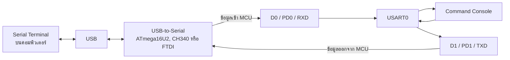

# EP02 - UART/USART: Serial Communication

EP นี้เรียนรู้การสื่อสาร Serial ของ ATmega328P ผ่าน USART0 โดยตรงด้วย
ภาษา C แบบ Register-Level ไม่ใช้ `Serial.begin()`, `Serial.print()`,
`Serial.available()` และ `Serial.read()` ของ Arduino Framework

ตัวอย่างจะสร้าง Command Console ขนาดเล็กสำหรับสั่ง LED บนบอร์ดที่ D13
ผ่าน Serial Terminal โดยใช้ Buffer ขนาดคงที่และไม่ใช้ Dynamic Memory
Allocation

เมื่ออ่านจบ EP นี้ควรตอบได้ว่า:

- UART และ USART ต่างกันอย่างไร
- D0/RX และ D1/TX ของ Arduino Uno เชื่อมกับ USART0 อย่างไร
- ค่า `UBRR0 = 103` สำหรับ 9600 baud มาจากไหน
- `UCSR0A`, `UCSR0B`, `UCSR0C` และ `UDR0` ทำหน้าที่อะไร
- ทำไมต้องรอ `UDRE0` ก่อนเขียนข้อมูลลง `UDR0`
- ทำไมต้องตรวจ `RXC0` ก่อนอ่านข้อมูลจาก `UDR0`
- Frame Format แบบ 8N1 หมายความว่าอะไร
- โปรแกรมแยกคำสั่ง `LED ON`, `LED OFF` และ `STATUS?` อย่างไร

> EP02 หน้านี้เป็นบทเรียนหลักและเรียงหัวข้อตามลำดับวิดีโอ ส่วนคู่มือ WSL,
> การ Flash และ Register พื้นฐานเป็นเอกสารอ้างอิงสำหรับเปิดดูเมื่อจำเป็น

## Chapter 1 — การเชื่อมต่อและผลลัพธ์

EP02 ไม่ต้องต่อ USB-to-Serial Module เพิ่ม เพราะ Arduino Uno มีวงจร
USB-to-Serial เชื่อมกับ USART0 ของ ATmega328P อยู่บนบอร์ดแล้ว

| อุปกรณ์ | การเชื่อมต่อ |
| --- | --- |
| Arduino Uno R3 | ต่อ USB กับคอมพิวเตอร์ |
| LED | ใช้ LED บนบอร์ดที่ D13/PB5 |
| Serial Terminal | เปิด Port ของ Uno ที่ 9600 baud |

ค่าการสื่อสารที่ใช้:

```text
Baud rate:  9600
Data bits:  8
Parity:     None
Stop bits:  1
Mode:       Asynchronous, normal speed
Frame:      8N1
```

หลัง Flash และเปิด Serial Terminal ควรเห็น:

```text
UART command ready
Commands: LED ON, LED OFF, STATUS?
>
```

คำสั่งที่ใช้สาธิต:

```text
LED ON
LED OFF
STATUS?
```

ผลลัพธ์:

```text
> LED ON
LED is ON
> STATUS?
LED status: ON
> LED OFF
LED is OFF
```

> ระหว่าง Upload และเปิด Serial Terminal ไม่ควรต่อวงจรภายนอกที่ D0/RX
> หรือ D1/TX เพราะอาจรบกวน USB-to-Serial และ Uno Bootloader

## Chapter 2 — UART และ USART คืออะไร

UART ย่อมาจาก Universal Asynchronous Receiver/Transmitter เป็นวงจร
Hardware สำหรับรับและส่งข้อมูล Serial แบบไม่มีสัญญาณ Clock แยก

USART ย่อมาจาก Universal Synchronous and Asynchronous
Receiver/Transmitter รองรับทั้งแบบ Synchronous และ Asynchronous

ATmega328P เรียก Peripheral นี้ว่า **USART0** แต่ EP02 ตั้งให้ทำงานใน
Asynchronous Mode จึงมีพฤติกรรมแบบ UART ที่ใช้งานทั่วไป

การสื่อสารเป็นแบบ Full-duplex:

- TX ใช้ส่งข้อมูลออกจาก MCU
- RX ใช้รับข้อมูลเข้า MCU
- TX และ RX สามารถทำงานพร้อมกันได้
- อุปกรณ์ทั้งสองฝั่งต้องใช้ Baud Rate และ Frame Format ตรงกัน

Arduino Framework ซ่อนรายละเอียดเหล่านี้ไว้หลังคำสั่ง:

```cpp
Serial.begin(9600);
Serial.println("Hello");
```

ส่วน EP02 จะกำหนด Baud Rate, Frame Format, Transmitter และ Receiver ผ่าน
Register ของ USART0 โดยตรง

## Chapter 3 — เส้นทาง D0/RX และ D1/TX ไปยัง Serial Terminal

ชื่อขาบน Arduino Uno และชื่อขาของ ATmega328P:

| ขาบน Uno | ขา MCU | หน้าที่ของ USART0 |
| --- | --- | --- |
| D0/RX | `PD0/RXD` | รับข้อมูลจาก USB-to-Serial เข้า ATmega328P |
| D1/TX | `PD1/TXD` | ส่งข้อมูลจาก ATmega328P ไป USB-to-Serial |
| D13 | `PB5` | LED ที่ควบคุมด้วย Command Console |



คำว่า RX และ TX อ้างจากมุมมองของ ATmega328P:

- D0/RX คือข้อมูลที่ MCU รับ
- D1/TX คือข้อมูลที่ MCU ส่ง

USB ไม่ได้เชื่อมกับ USART0 โดยตรง วงจร USB-to-Serial บนบอร์ดทำหน้าที่
แปลงข้อมูล USB ให้เป็นสัญญาณ Serial ที่ D0 และ D1

## Chapter 4 — คำนวณ Baud Rate 9600

Baud Rate กำหนดความเร็วในการส่งสัญลักษณ์ สำหรับ UART ทั่วไปหนึ่งสัญลักษณ์
แทนหนึ่ง bit จึงมักเรียกเป็น bit per second

ใน Asynchronous Normal Mode ใช้สูตรจาก Datasheet:

```text
UBRR0 = F_CPU / (16 × BAUD) - 1
```

แทนค่า Clock 16 MHz และ Baud Rate 9600:

```text
UBRR0 = 16,000,000 / (16 × 9,600) - 1
      = 103.166...
      เลือกใช้ 103
```

Baud Rate ที่ Hardware สร้างได้จริง:

```text
Actual baud = 16,000,000 / (16 × (103 + 1))
            = 9,615.38 baud

Error       ≈ +0.16%
```

Datasheet แสดงค่าประมาณเป็น Error 0.2% ซึ่งต่ำพอสำหรับการสื่อสาร 9600
baud ในตัวอย่างนี้

Source Code คำนวณค่าด้วย Macro:

```c
#define BAUD_RATE   9600UL
#define UBRR_VALUE  ((F_CPU / (16UL * BAUD_RATE)) - 1UL)
```

`UL` หมายถึง Unsigned Long ช่วยให้การคำนวณทำในขนาดข้อมูลที่รองรับ
16,000,000 โดยไม่ล้นแบบ Integer ขนาดเล็ก

`UBRR0` แบ่งเป็น Register สองส่วน:

```c
UBRR0H = (uint8_t)(UBRR_VALUE >> 8U);
UBRR0L = (uint8_t)UBRR_VALUE;
```

- `UBRR0H` รับ bit ส่วนบน
- `UBRR0L` รับ 8 bit ส่วนล่าง
- เมื่อค่าเท่ากับ 103 ส่วนบนเป็น 0 และส่วนล่างเป็น 103

## Chapter 5 — ตั้ง USART0 เป็น 8N1

Register ที่ใช้ตั้งค่า USART0:

| Register | หน้าที่ |
| --- | --- |
| `UBRR0H/L` | กำหนด Baud-rate Divider |
| `UCSR0A` | Status Flag และตัวเลือก Double Speed |
| `UCSR0B` | เปิด Receiver, Transmitter และ Interrupt |
| `UCSR0C` | กำหนด Mode, Parity, Stop bit และ Data bits |
| `UDR0` | Data Register สำหรับส่งหรือรับข้อมูลหนึ่ง byte |

ฟังก์ชันตั้งค่า:

```c
static void uart_init(void)
{
    UBRR0H = (uint8_t)(UBRR_VALUE >> 8U);
    UBRR0L = (uint8_t)UBRR_VALUE;

    UCSR0A = 0U;
    UCSR0B = (1U << RXEN0) | (1U << TXEN0);
    UCSR0C = (1U << UCSZ01) | (1U << UCSZ00);
}
```

### ใช้ Asynchronous Normal Speed

```c
UCSR0A = 0U;
```

- `U2X0 = 0` ใช้ Normal Speed และตัวหาร 16
- `MPCM0 = 0` ไม่ใช้ Multi-processor Communication Mode

### เปิด Receiver และ Transmitter

```c
UCSR0B = (1U << RXEN0) | (1U << TXEN0);
```

| Bit | ค่า | ผลลัพธ์ |
| --- | --- | --- |
| `RXEN0` | 1 | เปิด Receiver |
| `TXEN0` | 1 | เปิด Transmitter |
| USART Interrupt bits | 0 | ใช้ Polling ใน EP02 |
| `UCSZ02` | 0 | ทำงานร่วมกับ `UCSZ01:0` เพื่อเลือกข้อมูล 8 bit |

### กำหนด Frame Format แบบ 8N1

```c
UCSR0C = (1U << UCSZ01) | (1U << UCSZ00);
```

| ส่วนของ Frame | การตั้งค่า | ความหมาย |
| --- | --- | --- |
| Mode | `UMSEL01:0 = 00` | Asynchronous USART |
| Data bits | `UCSZ02:0 = 011` | 8 data bits |
| Parity | `UPM01:0 = 00` | None |
| Stop bit | `USBS0 = 0` | 1 stop bit |

8N1 จึงหมายถึง:

```text
8 data bits + No parity + 1 stop bit
```

Hardware ยังเพิ่ม Start bit ให้อัตโนมัติทุก Frame

## Chapter 6 — ส่งข้อความผ่าน USART0

ก่อนเขียน byte ใหม่ต้องรอให้ USART Data Register พร้อม:

```c
while ((UCSR0A & (1U << UDRE0)) == 0U) {
    /* รอให้ Transmit Register พร้อม */
}
UDR0 = (uint8_t)character;
```

`UDRE0` ย่อมาจาก USART Data Register Empty:

- `UDRE0 = 0` หมายถึง Buffer สำหรับส่งยังไม่พร้อมรับ byte ใหม่
- `UDRE0 = 1` หมายถึงเขียน byte ใหม่ลง `UDR0` ได้
- เมื่อเขียน `UDR0` แล้ว Hardware จะเลื่อน bit ออกทาง TXD อัตโนมัติ

`UDRE0` ไม่เหมือน `TXC0`:

- `UDRE0` บอกว่า Data Register พร้อมรับ byte ถัดไป
- `TXC0` บอกว่า Frame ทั้งหมดส่งออกจาก Shift Register เสร็จแล้ว

ฟังก์ชันส่งหนึ่งตัวอักษร:

```c
static void uart_putchar(char character)
{
    if (character == '\n') {
        while ((UCSR0A & (1U << UDRE0)) == 0U) {
        }
        UDR0 = (uint8_t)'\r';
    }

    while ((UCSR0A & (1U << UDRE0)) == 0U) {
    }
    UDR0 = (uint8_t)character;
}
```

เมื่อพบ `\n` โปรแกรมส่ง `\r` ก่อน แล้วจึงส่ง `\n` ทำให้ Terminal ได้
Line Ending แบบ CRLF และขึ้นบรรทัดใหม่ได้ถูกต้อง

ฟังก์ชันส่งข้อความ:

```c
static void uart_puts(const char *text)
{
    while (*text != '\0') {
        uart_putchar(*text);
        text++;
    }
}
```

C String จบด้วย Null Terminator `\0` ฟังก์ชันจึงส่งทีละตัวอักษรจนพบ
ตำแหน่งสิ้นสุด โดยไม่ต้องใช้ Arduino `String`

## Chapter 7 — รับข้อมูลผ่าน USART0

ตรวจว่ามีข้อมูลเข้ามาหรือยัง:

```c
static bool uart_rx_ready(void)
{
    return (UCSR0A & (1U << RXC0)) != 0U;
}
```

`RXC0` ย่อมาจาก USART Receive Complete:

- `RXC0 = 0` ยังไม่มี byte ใหม่ให้อ่าน
- `RXC0 = 1` มีข้อมูลที่ยังไม่ได้อ่านอยู่ใน Receive Buffer

อ่านข้อมูลหนึ่ง byte:

```c
static char uart_getchar(void)
{
    return (char)UDR0;
}
```

การอ่าน `UDR0` จะนำ byte ที่รับแล้วออกจาก Receive Buffer จากนั้น Hardware
จะจัดการสถานะ `RXC0` ตามข้อมูลที่ยังเหลืออยู่

EP02 ใช้ Polling:

```c
if (uart_rx_ready()) {
    const char received = uart_getchar();
}
```

ข้อดีคือเห็นลำดับ Register ชัดและโค้ดเริ่มต้นง่าย ข้อแลกเปลี่ยนคือ `main()`
ต้องกลับมาตรวจ `RXC0` บ่อย ๆ ตัวอย่างนี้ยังไม่ใช้ USART Interrupt และยังไม่
ตรวจ Framing Error, Data OverRun หรือ Parity Error

## Chapter 8 — สร้าง Command Console

โปรแกรมเก็บอักขระใน Buffer:

```c
#define COMMAND_CAPACITY 16U

char command[COMMAND_CAPACITY];
uint8_t length = 0U;
```

Buffer 16 byte เก็บคำสั่งได้สูงสุด 15 ตัวอักษร อีกหนึ่ง byte สงวนไว้สำหรับ
Null Terminator `\0`

ลำดับการรับคำสั่ง:

```text
รับหนึ่ง byte
  -> ถ้าเป็น CR ให้ข้าม
  -> ถ้าเป็น LF ให้ปิดท้าย String ด้วย \0
  -> นำ String ไปเทียบกับคำสั่ง
  -> ถ้าเป็นตัวอักษรทั่วไปให้เก็บลง Buffer
  -> ถ้า Buffer เต็มให้ยกเลิกคำสั่งและแจ้ง Command too long
```

โปรแกรมรองรับ LF และ CRLF:

- LF ใช้จบคำสั่ง
- CR ใน CRLF ถูกข้าม
- ถ้า Terminal ส่งเฉพาะ CR โปรแกรมจะยังไม่ประมวลผลคำสั่ง

คำสั่งต้องตรงทั้งตัวพิมพ์ใหญ่และช่องว่าง:

| คำสั่ง | การทำงาน | ข้อความตอบกลับ |
| --- | --- | --- |
| `LED ON` | Set `PORTB5` เป็น 1 | `LED is ON` |
| `LED OFF` | Clear `PORTB5` เป็น 0 | `LED is OFF` |
| `STATUS?` | อ่าน Output Latch ที่ `PORTB5` | `LED status: ON/OFF` |
| ค่าอื่น | ไม่เปลี่ยน LED | `Unknown command` |

ฟังก์ชัน `text_equal()` เปรียบเทียบ C String ทีละตัวอักษร:

```c
static bool text_equal(const char *left, const char *right)
{
    while ((*left != '\0') && (*right != '\0')) {
        if (*left != *right) {
            return false;
        }
        left++;
        right++;
    }

    return *left == *right;
}
```

Command Handler ควบคุม LED ที่ D13/PB5:

```c
if (text_equal(command, "LED ON")) {
    PORTB |= (1U << PORTB5);
    uart_puts("LED is ON\n");
} else if (text_equal(command, "LED OFF")) {
    PORTB &= ~(1U << PORTB5);
    uart_puts("LED is OFF\n");
}
```

ก่อนเริ่ม Console โปรแกรมกำหนด D13 เป็น Output และปิด LED:

```c
DDRB |= (1U << DDB5);
PORTB &= ~(1U << PORTB5);
```

## Chapter 9 — โค้ดฉบับเต็ม

```c
#include <avr/io.h>
#include <stdbool.h>
#include <stdint.h>

#ifndef F_CPU
#define F_CPU 16000000UL
#endif

#define BAUD_RATE   9600UL
#define UBRR_VALUE  ((F_CPU / (16UL * BAUD_RATE)) - 1UL)
#define COMMAND_CAPACITY 16U

static void uart_init(void)
{
    UBRR0H = (uint8_t)(UBRR_VALUE >> 8U);
    UBRR0L = (uint8_t)UBRR_VALUE;

    UCSR0A = 0U; /* ใช้ความเร็วปกติ ไม่เปิด U2X Mode */
    UCSR0B = (1U << RXEN0) | (1U << TXEN0);
    UCSR0C = (1U << UCSZ01) | (1U << UCSZ00); /* 8N1. */
}

static void uart_putchar(char character)
{
    if (character == '\n') {
        while ((UCSR0A & (1U << UDRE0)) == 0U) {
            /* รอให้ Transmit Register พร้อม */
        }
        UDR0 = (uint8_t)'\r';
    }

    while ((UCSR0A & (1U << UDRE0)) == 0U) {
        /* รอให้ Transmit Register พร้อม */
    }
    UDR0 = (uint8_t)character;
}

static void uart_puts(const char *text)
{
    while (*text != '\0') {
        uart_putchar(*text);
        text++;
    }
}

static bool uart_rx_ready(void)
{
    return (UCSR0A & (1U << RXC0)) != 0U;
}

static char uart_getchar(void)
{
    return (char)UDR0;
}

static bool text_equal(const char *left, const char *right)
{
    while ((*left != '\0') && (*right != '\0')) {
        if (*left != *right) {
            return false;
        }
        left++;
        right++;
    }

    return *left == *right;
}

static void handle_command(const char *command)
{
    if (text_equal(command, "LED ON")) {
        PORTB |= (1U << PORTB5);
        uart_puts("LED is ON\n");
    } else if (text_equal(command, "LED OFF")) {
        PORTB &= ~(1U << PORTB5);
        uart_puts("LED is OFF\n");
    } else if (text_equal(command, "STATUS?")) {
        if ((PORTB & (1U << PORTB5)) != 0U) {
            uart_puts("LED status: ON\n");
        } else {
            uart_puts("LED status: OFF\n");
        }
    } else if (*command != '\0') {
        uart_puts("Unknown command\n");
    }
}

int main(void)
{
    char command[COMMAND_CAPACITY];
    uint8_t length = 0U;

    DDRB |= (1U << DDB5);
    PORTB &= ~(1U << PORTB5);
    uart_init();

    uart_puts("UART command ready\n");
    uart_puts("Commands: LED ON, LED OFF, STATUS?\n> ");

    while (1) {
        if (uart_rx_ready()) {
            const char received = uart_getchar();

            if (received == '\r') {
                continue;
            }

            if (received == '\n') {
                command[length] = '\0';
                handle_command(command);
                length = 0U;
                uart_puts("> ");
            } else if (length < (COMMAND_CAPACITY - 1U)) {
                command[length] = received;
                length++;
            } else {
                length = 0U;
                uart_puts("\nCommand too long\n> ");
            }
        }
    }
}
```

ซอร์สที่ใช้ Build จริง: [src/main.c](src/main.c)

### ลำดับการทำงานของโปรแกรม

1. C runtime เรียก `main()` หลัง MCU Reset
2. ตั้ง D13/PB5 เป็น Output และปิด LED
3. คำนวณ `UBRR_VALUE` จาก Clock และ Baud Rate ตอน Compile
4. ตั้ง USART0 เป็น 9600 baud, 8N1
5. เปิด Receiver และ Transmitter
6. ส่งข้อความต้อนรับและรายการคำสั่ง
7. Poll `RXC0` เพื่อรอข้อมูล
8. เก็บอักขระลง Buffer จนพบ LF
9. เปรียบเทียบคำสั่งและควบคุม LED
10. ส่งผลลัพธ์กลับไปยัง Serial Terminal แล้วรอคำสั่งถัดไป

## Chapter 10 — Build, Flash และทดสอบ

หลังติดตั้งตาม [คู่มือเริ่มต้นด้วย WSL](../docs/wsl-setup.md) แล้ว ให้เปิด
Ubuntu และเข้า Root ของ Repository

Build และดูขนาด EP02:

```sh
make build-selected EP=EP02_UART
make size EP=EP02_UART
```

Flash โดยใช้ Port ที่ตรวจพบบนเครื่องจริง:

```sh
make flash EP=EP02_UART PORT=/dev/ttyUSB0
```

หรือ:

```sh
make flash EP=EP02_UART PORT=/dev/ttyACM0
```

ก่อน Flash ต้องปิด Serial Terminal ที่ใช้ Port เดียวกัน

เปิด Terminal หลัง Flash โดยเปิด Local Echo เพื่อให้เห็นคำสั่งที่พิมพ์ระหว่าง
การสาธิต และแปลง Enter จาก CR เป็น CRLF:

```sh
picocom --echo --imap crcrlf -b 9600 /dev/ttyUSB0
```

ถ้าใช้ `/dev/ttyACM0`:

```sh
picocom --echo --imap crcrlf -b 9600 /dev/ttyACM0
```

ออกจาก `picocom` ด้วย `Ctrl+A` แล้วกด `Ctrl+X`

ลำดับสาธิตที่แนะนำ:

1. เปิด Terminal และแสดงข้อความ `UART command ready`
2. พิมพ์ `LED ON` แล้วชี้ให้เห็น LED D13 ติด
3. พิมพ์ `STATUS?` แล้วแสดงผล `LED status: ON`
4. พิมพ์ `LED OFF` แล้วชี้ให้เห็น LED ดับ
5. พิมพ์คำสั่งผิด เช่น `HELLO` เพื่อแสดง `Unknown command`
6. อธิบายว่า Terminal, Firmware และ Register ทำงานเชื่อมกันอย่างไร

## เนื้อหาเสริม — เปรียบเทียบกับ Arduino API

| งาน | Arduino Framework | Native AVR C ใน EP02 |
| --- | --- | --- |
| เริ่ม Serial | `Serial.begin(9600)` | ตั้ง `UBRR0x`, `UCSR0x` |
| ตรวจข้อมูลเข้า | `Serial.available()` | ตรวจ `RXC0` |
| อ่านหนึ่ง byte | `Serial.read()` | อ่าน `UDR0` |
| ส่งหนึ่ง byte | `Serial.write()` | รอ `UDRE0` แล้วเขียน `UDR0` |
| ส่งข้อความ | `Serial.print()` | `uart_puts()` |
| เก็บข้อความ | Arduino `String` หรือ Array | Fixed-size C Buffer |

Arduino API เหมาะเมื่อเน้นพัฒนา Application ให้รวดเร็ว ส่วน Register-Level
ช่วยให้เห็น Baud Generator, Status Flag, Data Register และ Frame Format
ที่ Hardware ใช้จริง

## ข้อผิดพลาดที่พบบ่อย

- เปิด Serial Terminal ค้างไว้ขณะ Flash ทำให้ `avrdude` เปิด Port ไม่ได้
- ใช้ Baud Rate ใน Terminal ไม่ตรงกับ Firmware
- เลือก Line Ending เป็น None หรือ CR อย่างเดียว ทำให้คำสั่งไม่ถูกประมวลผล
- ไม่เปิด Local Echo แล้วคิดว่าโปรแกรมรับข้อมูลไม่ได้ เพราะไม่เห็นตัวอักษรที่พิมพ์
- ต่อ Hardware ภายนอกที่ D0/RX หรือ D1/TX แล้วรบกวน Upload/Serial
- เขียน `UDR0` โดยไม่รอ `UDRE0`
- อ่าน `UDR0` โดยไม่ตรวจ `RXC0`
- สับสน `UDRE0` กับ `TXC0`
- พิมพ์คำสั่งตัวเล็กหรือมีช่องว่างไม่ตรงกับข้อความที่ Parser รองรับ
- ส่งคำสั่งยาวเกิน 15 ตัวอักษรจน Buffer ถูกยกเลิก
- ใช้ค่า `F_CPU` หรือ Baud Rate ไม่ตรงกับ Clock จริงของบอร์ด

## เอกสารเสริม อ่านเมื่อใด

- [คู่มือเริ่มต้นด้วย WSL](../docs/wsl-setup.md) — ติดตั้ง Toolchain และ Attach USB
- [คู่มือการ Flash](../docs/flashing-guide.md) — แก้ปัญหา Port และ `avrdude`
- [Register พื้นฐาน](../docs/register-basics.md) — ทบทวน Register และ Bit Mask
- [Arduino Uno Pin Mapping](../docs/arduino-uno-pin-mapping.md) — แปลง D0/D1/D13 เป็นขา MCU
- [ATmega328P Datasheet](https://www.microchip.com/en-us/product/atmega328p) — USART0 Register และ Baud Rate
- [picocom Manual](https://manpages.debian.org/testing/picocom/picocom.1.en.html) — Local Echo และ Character Mapping

## สิ่งที่เรียนรู้

- เข้าใจเส้นทางข้อมูลจาก Serial Terminal ถึง USART0
- คำนวณ UBRR และ Baud Rate Error
- ตั้ง USART0 เป็น Asynchronous 8N1
- ส่งและรับข้อมูลด้วย `UDR0`
- Poll `UDRE0` และ `RXC0`
- จัดการ CR, LF และ CRLF
- Parse คำสั่งด้วย Fixed-size Buffer
- ใช้ UART เป็น Debug และ Command Channel ของ Firmware

ตอนถัดไป: [EP03 - Timer](../EP03_TIMER/README.md)
