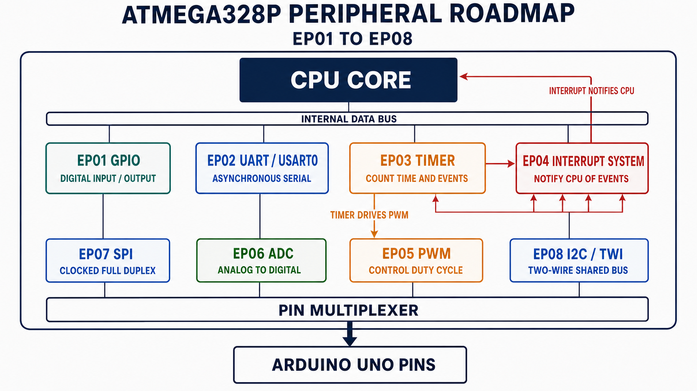
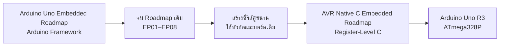
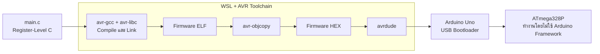

# AVR Native C Embedded Roadmap

Repository คู่ขนานแบบ Native AVR C ของ
[Arduino Uno Embedded Roadmap](https://github.com/KOPE-SOLUTION/arduino-uno-embedded-roadmap)
โดยควบคุม Register และ Peripheral ของ ATmega328P โดยตรง

ซีรีส์นี้คงลำดับการเรียน EP01-EP08 เดิม แต่เปลี่ยนจาก Arduino API มาเป็น
Register-Level C เพื่อให้เห็นการทำงานภายในของ GPIO, USART, Timer,
Interrupt, PWM, ADC, SPI และ I2C/TWI

```c
/* Arduino Framework */
digitalWrite(13, HIGH);

/* Native AVR C */
PORTB |= (1U << PORTB5);
```

## Chapter 1 — ซีรีส์นี้คืออะไร

| รายการ | สิ่งที่เลือกใช้ |
| --- | --- |
| MCU เป้าหมาย | ATmega328P |
| บอร์ดอ้างอิง | Arduino Uno R3 ความถี่ 16 MHz |
| ภาษา | C |
| Framework | ไม่มี |
| ระดับการเขียนโปรแกรม | Register-Level |
| ทางเลือกทั่วไปที่ใช้ GUI จากผู้ผลิต | MPLAB X หรือ MPLAB for VS Code + MPLAB XC8 |
| สภาพแวดล้อมที่ใช้ในซีรีส์นี้ | WSL 2 + Ubuntu 24.04 + avr-gcc + avr-libc + Make + avrdude |
| เหตุผลที่ซีรีส์เลือก WSL | เคยใช้ Workflow นี้กับ Uno สำเร็จ มี WSL อยู่แล้ว และไม่ต้องติดตั้ง IDE เพิ่ม |

`<avr/io.h>` ทำหน้าที่ประกาศชื่อ Register ของ MCU ที่เลือก ไม่ใช่ Arduino
Framework ทุกตัวอย่างมี `main()` ของตัวเอง และสามารถศึกษา/Build แยกกันได้

> **หมายเหตุเรื่อง MCU:** Microchip ระบุสถานะ ATmega328P ว่า
> "Not Recommended for new designs" แต่ MCU รุ่นนี้ยังเหมาะกับ Repository นี้
> เพราะเป้าหมายคือเปรียบเทียบ Native C กับ Arduino Uno Series เดิมโดยตรง
> สำหรับผลิตภัณฑ์ใหม่ควรประเมิน AVR Family รุ่นปัจจุบันแยกต่างหาก

## Chapter 2 — Arduino Framework ไม่ได้แย่ แล้วเมื่อไหร่ควรใช้ Native

Arduino Framework เป็นเครื่องมือที่ดีสำหรับเริ่มต้น ทดลองแนวคิด และใช้งาน
Library ได้รวดเร็ว ซีรีส์นี้ไม่ได้สร้างขึ้นเพื่อบอกให้เลิกใช้ Arduino Code
แต่ใช้ Native AVR C เพื่อเปิดดูสิ่งที่ API จัดการให้อยู่เบื้องหลัง

| เลือก Arduino Framework เมื่อ | เลือก Native AVR C เมื่อ |
| --- | --- |
| ต้องการสร้าง Prototype ให้ทำงานเร็ว | ต้องการเข้าใจ Register และ Peripheral |
| ต้องการใช้ Library หรือ Module จำนวนมาก | ต้องการอ่าน Datasheet แล้วควบคุม Hardware โดยตรง |
| รายละเอียดระดับ Clock Cycle ไม่ใช่ประเด็นหลัก | ต้องควบคุม Timing, Memory หรือพฤติกรรมของ Peripheral ชัดเจน |
| ทีมคุ้นเคยกับ Arduino Ecosystem | ต้องการพื้นฐานเพื่อต่อยอดไปยัง MCU และ Toolchain อื่น |

### Clock Cycle, Timing, Memory และพฤติกรรมของ Peripheral คืออะไร

สี่คำนี้เกี่ยวข้องกัน แต่ไม่ได้หมายถึงเรื่องเดียวกัน:

| คำ | คำถามที่กำลังตอบ | ตัวอย่างบน Arduino Uno |
| --- | --- | --- |
| **Clock Cycle** | CPU มีจังหวะพื้นฐานเร็วเพียงใด และคำสั่งใช้กี่จังหวะ | Clock 16 MHz มีเวลา 62.5 ns ต่อ 1 Clock Cycle |
| **Timing** | เหตุการณ์ต้องเกิดเมื่อใด นานเท่าไร หรือบ่อยเพียงใด | ทำให้ Timer สร้างเหตุการณ์ทุก 1 ms หรือส่ง UART ที่ 9600 Baud |
| **Memory** | Code และข้อมูลใช้พื้นที่ชนิดใดไปเท่าไร | ATmega328P มี Flash 32 KB, SRAM 2 KB และ EEPROM 1 KB |
| **พฤติกรรมของ Peripheral** | Hardware ภายในถูกตั้งให้ทำงานใน Mode ใด | UART ใช้ 8N1, Timer ใช้ Prescaler เท่าไร หรือ ADC ใช้แรงดันอ้างอิงใด |

#### 1. Clock Cycle — จังหวะพื้นฐานของ CPU

Arduino Uno ใช้ Clock 16 MHz หมายความว่า CPU ได้รับจังหวะ Clock
16,000,000 ครั้งต่อวินาที ดังนั้นหนึ่งจังหวะใช้เวลา:

```text
1 / 16,000,000 = 0.0000000625 วินาที = 62.5 ns
```

คำสั่งภาษาเครื่องแต่ละคำสั่งอาจใช้หนึ่ง Clock Cycle หรือหลาย Clock Cycle
แต่หนึ่งบรรทัดภาษา C ไม่ได้เท่ากับหนึ่ง Clock Cycle เสมอไป เพราะ Compiler
อาจแปลงบรรทัดนั้นเป็นคำสั่งภาษาเครื่องหลายคำสั่ง หรือปรับแต่งจนเหลือน้อยลง

ตัวอย่างเช่น `digitalWrite(13, HIGH)` ต้องผ่านขั้นตอนของ Arduino Core
เพื่อค้นหา Pin และจัดการ Register ที่เกี่ยวข้อง ส่วนคำสั่ง:

```c
PORTB |= (1U << PORTB5);
```

ระบุโดยตรงว่าต้องการตั้ง Bit ของขา PB5 จึงมองเห็นงานที่ต้องการให้ Hardware
ทำได้ชัดกว่า และโดยทั่วไปมีขั้นตอนน้อยกว่า อย่างไรก็ตาม Native C
ไม่ได้รับประกันจำนวน Clock Cycle โดยอัตโนมัติ หากงานต้องแม่นระดับ Cycle
จริง ๆ ยังต้องตรวจ Assembly ที่ Compiler สร้าง รวมถึงผลจาก Interrupt ด้วย

#### 2. Timing — เหตุการณ์ต้องเกิดเมื่อใดและนานเท่าไร

Clock Cycle คือหน่วยเวลาพื้นฐาน ส่วน Timing คือข้อกำหนดของงาน เช่น:

- LED ต้องเปลี่ยนสถานะทุก 500 ms
- Timer ต้องแจ้งเหตุทุก 1 ms
- PWM ต้องมีความถี่ 1 kHz และ Duty Cycle 25%
- UART ต้องส่งข้อมูลที่ 9600 Baud
- Interrupt ต้องได้รับการตอบสนองก่อนเวลาที่กำหนด

การตั้ง Timer แบบ Register-level ทำให้มองเห็นเส้นทางของเวลาได้ชัดเจน:

```text
Clock 16 MHz → Prescaler → Timer Tick → Compare Match → เหตุการณ์
```

เราจึงเลือก Prescaler, ค่า Compare และ Timer Mode ให้ตรงกับเวลาที่ต้องการได้
โดยตรง แต่ความแม่นยำยังขึ้นอยู่กับ Clock จริงของบอร์ด ความคลาดเคลื่อนของ
แหล่งกำเนิด Clock ระยะเวลาของ Interrupt และวิธีที่ Compiler สร้าง Code ด้วย

#### 3. Memory — โปรแกรมกำลังใช้พื้นที่ใด

ATmega328P มี Memory หลักที่ควรรู้จัก:

| Memory | ขนาด | ใช้เก็บอะไร |
| --- | ---: | --- |
| Flash | 32 KB | Program Code และค่าคงที่บางส่วน |
| SRAM | 2 KB | ตัวแปร, Buffer, Stack และข้อมูลระหว่างทำงาน |
| EEPROM | 1 KB | ข้อมูลที่ต้องการเก็บไว้แม้ปิดไฟ |

ข้อจำกัดที่พบได้ง่ายที่สุดคือ SRAM เพราะมีเพียง 2 KB ตัวอย่างเช่น Buffer
ขนาด 256 Bytes ใช้ SRAM ไปแล้ว `256 / 2048 × 100 = 12.5%` โดยยังไม่รวม
ตัวแปรอื่นและ Stack หากใช้ Library หลายตัวหรือจัดสรร Memory แบบ Dynamic
ก็อาจใช้ SRAM เพิ่มและเกิด Memory Fragmentation ได้

Arduino Framework ไม่ได้ทำให้ Memory เต็มเสมอไป แต่ Native C ช่วยให้เห็นว่า
Code ใดและข้อมูลใดถูกนำเข้ามา ทำให้เลือกขนาด Buffer ลด Dependency และตรวจ
Memory Usage ด้วยคำสั่งอย่าง `make size EP=EP01_GPIO` ได้ตรงขึ้น

#### 4. พฤติกรรมของ Peripheral — Hardware ถูกตั้งให้ทำงานแบบใด

Peripheral คือวงจร Hardware ภายใน MCU เช่น UART, Timer, ADC, SPI และ
I2C/TWI โดย Arduino API มักเลือกค่าที่เหมาะกับการใช้งานทั่วไปให้แล้ว
ส่วน Native C เปิดให้เราเห็นและกำหนดรายละเอียดเหล่านั้นผ่าน Register:

| Arduino API | สิ่งที่ API ช่วยจัดการ | สิ่งที่กำหนดโดยตรงใน Native C |
| --- | --- | --- |
| `Serial.begin(9600)` | Baud Rate, การเปิด TX/RX และรูปแบบ Frame เริ่มต้น | `UBRR0`, `UCSR0A/B/C` และรูปแบบอย่าง 8N1 |
| `analogWrite()` | Timer, PWM Mode และขา Output Compare | `TCCRnA/B`, `OCRn` และ Prescaler |
| `analogRead()` | แรงดันอ้างอิง, Channel และการเริ่ม Conversion | `ADMUX`, `ADCSRA` และสถานะการแปลง |
| `attachInterrupt()` | ขอบสัญญาณและการเปิด Interrupt | `EICRA`, `EIMSK`, `EIFR` และ ISR |

คำว่า “ควบคุมได้ชัดเจน” จึงหมายถึง เมื่อมีคำถามว่า PWM มีความถี่เท่าไร,
UART ใช้ Frame แบบใด หรือ ADC ใช้ Clock เท่าไร เราสามารถชี้ไปที่ Register,
Bit และค่าที่ใช้คำนวณได้ ไม่ได้หมายความว่า Native C จะดีกว่าหรือเร็วกว่า
Arduino Framework ในทุกกรณี

เป้าหมายจึงไม่ใช่การตัดสินว่าแบบใดดีกว่า แต่คือการมองเห็นทั้งสองระดับและ
เลือกใช้ให้เหมาะกับงาน

## Chapter 3 — Roadmap EP01–EP08

### ภาพรวม Peripheral ภายใน ATmega328P



*CPU Core ติดต่อ Peripheral ผ่าน Internal Data Bus ส่วน Pin Multiplexer
เชื่อมหน้าที่ของ Peripheral ออกไปยังขาจริงของ Arduino Uno*

ภาพนี้ช่วยให้เห็นว่า EP01–EP08 ไม่ได้เป็นหัวข้อที่แยกจากกันทั้งหมด:

- `Timer` เป็นพื้นฐานของ `PWM` จึงมีลูกศรจาก EP03 ไป EP05
- `Interrupt System` รับ Event จาก Peripheral แล้วแจ้งให้ CPU เปลี่ยนไปทำ ISR
- `GPIO`, `UART`, `PWM`, `ADC`, `SPI` และ `I2C/TWI` ใช้ขาของ MCU ผ่าน
  Pin Multiplexer
- ขาหนึ่งขาอาจมีหลายหน้าที่ แต่ Firmware ต้องเลือกและตั้งค่า Peripheral
  ให้ตรงกับหน้าที่ที่ต้องการใช้
- ตำแหน่งกล่องในภาพจัดตามความสัมพันธ์ของ Hardware ไม่ใช่ลำดับการเรียน
  ให้เรียนต่อเนื่องตามหมายเลข EP01–EP08 ในตารางด้านล่าง

| EP | หัวข้อ | ระดับ Arduino | Register สำคัญ | ตัวอย่าง |
| --- | --- | --- | --- | --- |
| 01 | [GPIO](EP01_GPIO/README.md) | `pinMode`, `digitalRead`, `digitalWrite` | `DDRx`, `PORTx`, `PINx` | ปุ่มควบคุม LED |
| 02 | [UART](EP02_UART/README.md) | `Serial` | `UBRR0`, `UCSR0x`, `UDR0` | Console รับคำสั่งข้อความ |
| 03 | [Timer](EP03_TIMER/README.md) | `millis` | `TCCR1x`, `TCNT1`, `OCR1A`, `TIFR1` | LED กระพริบแบบ Non-blocking |
| 04 | [Interrupt](EP04_INTERRUPT/README.md) | `attachInterrupt` | `EICRA`, `EIMSK`, `EIFR`, ISR | Event จากปุ่ม |
| 05 | [PWM](EP05_PWM/README.md) | `analogWrite` | `TCCR1x`, `OCR1A` | Fade LED ที่ D9 |
| 06 | [ADC](EP06_ADC/README.md) | `analogRead` | `ADMUX`, `ADCSRA`, `ADC` | Potentiometer ควบคุม PWM |
| 07 | [SPI](EP07_SPI/README.md) | `SPI`, `SD` | `SPCR`, `SPSR`, `SPDR` | Raw SD Card Handshake |
| 08 | [I2C/TWI](EP08_I2C/README.md) | `Wire` | `TWBR`, `TWSR`, `TWCR`, `TWDR` | I2C Address Scanner |

EP07 จงใจหยุดก่อนชั้น FAT Filesystem เพื่อให้เห็น Native SPI Transaction
และ SD Command แรกอย่างชัดเจน รวมถึงแยกขอบเขตระหว่าง Bus Driver,
SD Protocol และ Filesystem

## Chapter 4 — ที่มาและภาพรวม Workflow

### ที่มาของซีรีส์

Repository นี้ต่อยอดจาก
[Arduino Uno Embedded Roadmap](https://github.com/KOPE-SOLUTION/arduino-uno-embedded-roadmap)
ที่สอน GPIO, UART, Timer, Interrupt, PWM, ADC, SPI และ I2C ผ่าน Arduino API
เมื่อจบ Roadmap เดิมจึงเกิดแนวคิดสร้างซีรีส์คู่ขนานที่ใช้หัวข้อและบอร์ดเดิม
แต่เปิดให้เห็นการทำงานระดับ Register ของ ATmega328P



**บอร์ดอ้างอิงและบอร์ดที่ใช้ทดลองจริงคือ Arduino Uno ตั้งแต่ต้น** เนื้อหา
ทุก EP จึงอ้างอิง ATmega328P และ Pin Mapping ของ Uno โดยตรง

### ภาพรวม Workflow ที่ใช้จริง

ก่อนจัดเนื้อหาเป็น Repository ผู้จัดทำได้ทดลอง Workflow Native AVR C กับ
Arduino Uno โดยแยกขั้นตอนที่ Arduino IDE เคยจัดการให้ออกมาให้เห็นชัดเจน:



Workflow นี้ทำให้เห็นความสัมพันธ์ระหว่าง Source Code, Compiler, Linker,
ELF, HEX, Upload Tool และ Bootloader จึงนำมาเป็นพื้นฐานของ EP01–EP08
โดยเปลี่ยนเฉพาะวิธีเขียนจาก Arduino API เป็น Register-Level C แต่ยังใช้
Arduino Uno และลำดับการเรียนรู้เดิม

ในบันทึกการทดลองอาจเรียกแนวทางนี้ว่า Bare Metal C ส่วน Repository ใช้คำว่า
**Native AVR C / Register-Level C** เพื่อระบุขอบเขตให้ชัดว่าไม่ใช้ Arduino
Framework แต่ยังใช้ Compiler Header, C Runtime และ Startup Code มาตรฐาน
ของ Toolchain

## Chapter 5 — เลือก MPLAB หรือ WSL

ไม่มีคำตอบเดียวว่า Toolchain ใดคือสิ่งที่ “คนส่วนใหญ่ใช้” เพราะแต่ละกลุ่ม
ใช้ Hardware และ Workflow ต่างกัน สิ่งสำคัญคือแยกสามเรื่องออกจากกัน:

- **Arduino Framework** คือ Software Layer และ API ที่ช่วยให้เขียนโค้ดง่าย
- **MPLAB / WSL** คือ Development Environment บนเครื่องผู้พัฒนา
- **XC8 / avr-gcc** คือ Compiler ที่สร้าง Machine Code สำหรับ AVR

ดังนั้น MPLAB และ WSL ต่างก็ใช้เขียน Native AVR C ได้ ความเป็น Native ของ
Repository นี้เกิดจากการควบคุม Register โดยตรงและไม่ Link Arduino Core
ไม่ได้เกิดจากชื่อ IDE หรือ Operating System

| สถานการณ์ | ตัวเลือกที่เหมาะ |
| --- | --- |
| ต้องการ GUI, Project Wizard และ Tool จากผู้ผลิต | MPLAB X + XC8 |
| ต้องการใช้ MPLAB Ecosystem ใน VS Code | MPLAB for VS Code + XC8 |
| ต้องการ Command Line และ Build ที่ทำซ้ำได้ | WSL + avr-gcc + Make |
| มี Arduino Uno และต้องการ Upload ผ่าน USB Bootloader | avrdude ผ่าน WSL หรือ Native Windows |
| ใช้ Microchip Programmer/Debugger ผ่าน ICSP | MPLAB + Hardware Tool ที่รองรับ |

### ทางเลือกทั่วไปสำหรับผู้เริ่มต้น: MPLAB + XC8

ถ้าผู้เรียนต้องการติดตั้งแล้วทำงานผ่าน GUI เป็นหลัก `MPLAB X + XC8`
เข้าใจง่ายกว่าในช่วงเริ่มต้น เพราะ IDE ช่วยเลือก Device, Compiler,
Build Configuration และแสดงข้อมูล Register/bit ภายใน Project เดียว
MPLAB ยังเชื่อมกับ Programmer และ Debugger ของ Microchip ได้โดยตรง

Microchip มีทั้ง
[MPLAB X IDE](https://www.microchip.com/en-us/tools-resources/develop/mplab-x-ide)
และ
[MPLAB for VS Code](https://www.microchip.com/en-us/tools-resources/develop/mplab-tools-vs-code)
ส่วน [MPLAB XC8](https://www.microchip.com/en-us/tools-resources/develop/mplab-xc-compilers/xc8)
รองรับ AVR 8-bit โดยตรง

อย่างไรก็ตาม Arduino Uno R3 ไม่มี Microchip Debugger อยู่บนบอร์ด ช่อง USB
ของ Uno ติดต่อ ATmega328P ผ่าน USB-to-Serial และ Bootloader หากต้องการ
Program/Debug จาก MPLAB แบบเต็มรูปแบบจะต้องมี Hardware Tool ที่รองรับต่อ
ผ่าน ICSP หรือใช้ `avrdude` แยกสำหรับ Upload ผ่าน Bootloader เดิม

## Chapter 6 — เหตุผลที่ซีรีส์เลือก WSL

ซีรีส์นี้สานต่อ Workflow Native AVR C ที่ผู้จัดทำเคยทดลองกับ Arduino Uno
และ ATmega328P สำเร็จแล้ว โดยใช้ WSL สร้าง ELF/HEX และใช้ `avrdude` ส่ง
Firmware ผ่าน Uno Bootloader

เป้าหมายของ Repository คือให้ Build และ Flash จาก WSL ได้ใน Environment
เดียว แต่ Workflow แบบผสมที่ Build ใน WSL แล้ว Flash ด้วย `avrdude` บน
Windows ยังคงใช้เป็นทางเลือกสำรองได้

การเลือกนี้ไม่ได้หมายความว่า WSL ง่ายที่สุดสำหรับทุกคนหรือ Native กว่า
MPLAB เหตุผลมาจากประสบการณ์จริงและรูปแบบการสอนของผู้จัดทำ:

- เป็น Workflow ที่เคยใช้กับ Arduino Uno สำเร็จและคุ้นเคยอยู่แล้ว
- เครื่องที่ใช้ทำซีรีส์มี WSL, Ubuntu และ VS Code อยู่แล้ว ผู้จัดทำจึงไม่
  ต้องการติดตั้ง MPLAB X, XC8 และส่วนประกอบของ IDE เพิ่มเพื่อใช้กับซีรีส์นี้
  ช่วยลดพื้นที่ติดตั้งเพิ่มเติมและไม่สร้าง Development Environment ซ้ำซ้อน
- ผู้จัดทำเคยพบปัญหาการติดตั้ง, `PATH` และ Version ของ AVR Toolchain บน
  Windows โดยตรง แต่ใช้คำสั่งบน Linux ได้สม่ำเสมอกว่าในเครื่องเดียวกัน
- Package ที่ต้องใช้ติดตั้งซ้ำได้ด้วยคำสั่งเดียว ทำให้ผู้เรียนตรวจ Version
  และทำตามขั้นตอนได้ง่ายกว่าการอ้างอิง Path เฉพาะเครื่อง
- Makefile แสดงขั้นตอน Compile, Link, สร้างไฟล์ HEX และ Flash อย่างเปิดเผย
  จึงสอดคล้องกับเป้าหมายที่ต้องการมองเห็นสิ่งที่ Arduino IDE ซ่อนไว้
- ไฟล์ Build Configuration เป็น Text File ที่เก็บใน Git และเปรียบเทียบได้
  โดยไม่ต้องเก็บ IDE Project Metadata จำนวนมาก
- ใช้ Editor และ Terminal ชุดเดียวกับ Project อื่นได้ ไม่ต้องสลับ Workflow
  ตาม IDE ของ MCU แต่ละตระกูล
- `avr-gcc` ไม่ใช่ Toolchain เฉพาะกลุ่มเล็ก Microchip มี AVR GNU Toolchain
  ให้ใช้งาน และ Arduino AVR Platform ก็ใช้ `avr-gcc` กับ `avrdude`
  อยู่เบื้องหลัง
- ซอร์ส `main.c` ยังคงนำไปสร้าง MPLAB Project และ Build ด้วย XC8 ได้ภายหลัง

ข้อแลกเปลี่ยนคือ WSL ต้องตั้งค่า `usbipd` ก่อนเห็น Arduino Uno, ต้องคุ้นเคย
กับ Terminal และไม่มีปุ่ม Program/Debug แบบรวมศูนย์ของ MPLAB จึงควรบอก
ผู้เรียนตรงไปตรงมาว่านี่คือ Workflow ที่ผู้จัดทำเลือก ไม่ใช่มาตรฐานเดียว
ที่ทุกคนต้องใช้

เหตุผลเรื่องพื้นที่เป็นบริบทเฉพาะของผู้จัดทำ เพราะมี WSL อยู่ก่อนแล้ว
หากผู้เรียนมี MPLAB พร้อมใช้งาน แต่ยังไม่มี WSL การติดตั้ง WSL ใหม่อาจไม่ได้
ประหยัดพื้นที่หรือขั้นตอนกว่า จึงไม่จำเป็นต้องเปลี่ยน Environment เพียงเพื่อ
ให้เหมือนในวิดีโอ

ข้อความสรุปสำหรับใช้พูดในวิดีโอบทนำ:

> ซีรีส์นี้ใช้ Arduino Uno และ ATmega328P เป็น Hardware ตั้งแต่ต้น ผู้จัดทำ
> เคยใช้ WSL Compile โค้ด Register-Level C เป็น ELF และ HEX แล้ว Flash ผ่าน
> Uno Bootloader ได้สำเร็จ จึงนำ Workflow ที่คุ้นเคยมาจัดเป็น Roadmap
> EP01–EP08 เครื่องที่ใช้ทำซีรีส์มี WSL และ VS Code อยู่แล้ว จึงไม่ต้องการ
> ติดตั้ง MPLAB X, XC8 และส่วนประกอบเพิ่ม อีกทั้ง Makefile ทำให้ผู้เรียน
> มองเห็น Compile, Link และ Flash ได้ทุกขั้นตอน การเลือก WSL ไม่ได้หมายความ
> ว่า MPLAB หรือ Arduino IDE ไม่ดี และไม่ได้ทำให้โค้ด Native กว่าเดิม
> ผู้เรียนสามารถใช้ MPLAB X กับ XC8 แทนได้ เพราะหัวใจของบทเรียนคือการเขียน
> C เพื่อควบคุม Register ของ ATmega328P โดยตรง

## Chapter 7 — เตรียมเครื่องและเริ่ม EP01

เปิด Ubuntu จาก Windows PowerShell:

```powershell
wsl -d Ubuntu-24.04
```

ติดตั้ง Toolchain ภายใน Ubuntu:

```sh
sudo apt update
sudo apt install -y gcc-avr avr-libc binutils-avr avrdude make usbutils picocom
```

จากนั้นเข้า Directory ของ Repository แล้ว Build:

```sh
make all
make build-selected EP=EP01_GPIO
make size EP=EP01_GPIO
make flash EP=EP01_GPIO PORT=/dev/ttyUSB0
```

Board ที่ใช้ USB-to-Serial แบบ CH340 มักปรากฏเป็น `/dev/ttyUSB0`
ส่วน Uno R3 ที่ใช้ ATmega16U2 มักปรากฏเป็น `/dev/ttyACM0` ให้ตรวจชื่อจริง
ก่อน Flash อ่านขั้นตอนครบได้ใน [คู่มือติดตั้ง WSL](docs/wsl-setup.md)
และดูการเปรียบเทียบทางเลือกใน
[คู่มือติดตั้ง Toolchain](docs/toolchain-setup.md)

## โครงสร้าง Repository

```text
avr-native-c-embedded-roadmap/
|-- README.md
|-- LICENSE
|-- Makefile
|-- docs/
|   |-- wsl-setup.md
|   |-- toolchain-setup.md
|   |-- arduino-uno-pin-mapping.md
|   |-- register-basics.md
|   `-- flashing-guide.md
|-- EP01_GPIO/
|   |-- README.md
|   `-- src/main.c
`-- ... EP02_UART through EP08_I2C
```

## ข้อตกลงเกี่ยวกับฮาร์ดแวร์

- Arduino Uno R3 ใช้ ATmega328P ที่ความถี่ 16 MHz
- ตัวอย่างไม่เปลี่ยน Clock Fuse หรือ Bootloader Fuse เดิมของ Uno
- D0/D1 ใช้ร่วมกับวงจร USB-to-Serial บนบอร์ด
- อุปกรณ์ I2C ต้องมี Pull-up ที่ SDA และ SCL โดย Module หลายรุ่นมีมาให้แล้ว
- MicroSD Card เปล่าใช้ไฟ 3.3 V ต้องใช้ Module หรือ Level Conversion ที่
  ปลอดภัยกับ Logic 5 V ของ Uno

ถอดแหล่งจ่ายไฟก่อนเปลี่ยนการต่อวงจร และเชื่อม GND ของอุปกรณ์ที่สื่อสารกัน
เข้าด้วยกันเสมอ

## เอกสารอ้างอิง

- [หน้าผลิตภัณฑ์และ Datasheet ของ ATmega328P](https://www.microchip.com/en-us/product/atmega328p)
- [MPLAB X IDE](https://www.microchip.com/en-us/tools-resources/develop/mplab-x-ide)
- [MPLAB XC8 Compiler](https://www.microchip.com/en-us/tools-resources/develop/mplab-xc-compilers/xc8)
- [Microchip AVR GNU Toolchain](https://www.microchip.com/en-us/development-tool/AVR-GCC)
- [Arduino AVR build process](https://docs.arduino.cc/arduino-cli/sketch-build-process/)
- [การพัฒนาด้วย VS Code และ WSL](https://learn.microsoft.com/en-us/windows/wsl/tutorials/wsl-vscode)
- [เอกสาร Arduino Uno R3](https://docs.arduino.cc/hardware/uno-rev3/)

## สิทธิ์ใช้งาน (License)

ใช้ [MIT License](LICENSE)
