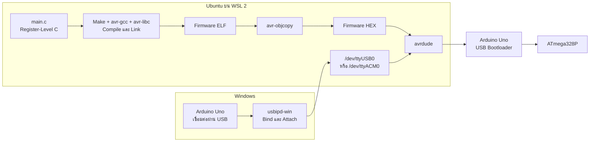

# เริ่มต้นด้วย WSL 2, avr-gcc และ Arduino Uno

คู่มือนี้ใช้สำหรับผู้ที่ต้องการทำตามสภาพแวดล้อมของซีรีส์ โดยใช้ Ubuntu บน
WSL 2 สำหรับ Compile, Build และ Flash โค้ด Native AVR C ลง Arduino Uno

WSL ไม่ใช่ข้อกำหนดของการเขียน Native AVR C และไม่จำเป็นต้องเลือก WSL
หาก MPLAB X + XC8 ทำงานได้เหมาะกับเครื่องและ Workflow ของผู้เรียนอยู่แล้ว
ดูข้อแตกต่างก่อนตัดสินใจได้ใน [คู่มือเลือก Toolchain](toolchain-setup.md)

ซีรีส์เลือก WSL เพราะเครื่องที่ใช้ผลิตเนื้อหามี WSL, Ubuntu และ VS Code
อยู่แล้ว ผู้จัดทำจึงไม่ต้องการติดตั้ง MPLAB X, XC8 และส่วนประกอบของ IDE
เพิ่มสำหรับซีรีส์นี้ นอกจากลดพื้นที่ติดตั้งเพิ่มเติมแล้วยังหลีกเลี่ยง
Development Environment ที่ซ้ำซ้อน ผู้จัดทำยังเคยพบปัญหา `PATH`, Package
และ Version ของ AVR Toolchain บน Windows โดยตรง ขณะที่ Linux Workflow
สามารถติดตั้งซ้ำและตรวจสอบด้วยคำสั่งเดียวกันได้ทุก EP

Makefile ยังเปิดเผยขั้นตอน Compile, Link, สร้าง HEX และ Flash ซึ่งสอดคล้อง
กับเป้าหมายของบทเรียน Register-Level อย่างไรก็ตาม เหตุผลเรื่องพื้นที่นี้
ใช้ได้เพราะมี WSL อยู่ก่อนแล้ว ไม่ได้แปลว่าการติดตั้ง WSL ใหม่จะใช้พื้นที่
น้อยกว่า MPLAB สำหรับผู้เรียนทุกคน

ข้อแลกเปลี่ยนคือการตั้งค่า USB ผ่าน `usbipd-win` และการใช้ Terminal ใน
ครั้งแรกมีหลายขั้นตอนกว่า MPLAB ส่วน Windows ยังคงทำหน้าที่เชื่อม USB
Device ให้ WSL ตลอด Workflow นี้

## ที่มาของ Workflow นี้

ก่อนมี Repository นี้ ผู้จัดทำใช้ Arduino Uno และ ATmega328P ทดลองเขียน
Register-Level C สำหรับ D13/PB5 แล้วแยกขั้นตอนที่ Arduino IDE ทำให้ออกมา:


ขั้นตอนนี้ทำงานสำเร็จและทำให้เข้าใจความสัมพันธ์ระหว่าง Source Code, ELF,
HEX, Upload Tool และ Bootloader เมื่อนำมาจับคู่กับหัวข้อ EP01–EP08 ของ
Arduino Uno Embedded Roadmap เดิม จึงเกิดเป็นซีรีส์ Native AVR C นี้

คู่มือปัจจุบันใช้ `usbipd-win` เพื่อให้ `avrdude` เข้าถึง Uno จาก WSL ได้
โดยตรงและทำ Build/Flash ใน Terminal เดียว หาก USB Passthrough มีปัญหา
สามารถ Build ไฟล์ HEX ใน WSL แล้ว Flash จาก Windows ด้วย `avrdude` ได้
ดูทางเลือกใน [คู่มือการ Flash](flashing-guide.md)

## ภาพรวมของ Workflow



## 1. สิ่งที่ต้องมี

- Windows 10 หรือ Windows 11 ที่รองรับ WSL 2
- Ubuntu บน WSL 2 แนะนำ `Ubuntu-24.04`
- `usbipd-win` รุ่น 5.x หรือใหม่กว่า
- Arduino Uno R3 หรือบอร์ด Clone ที่ใช้ ATmega328P
- สาย USB ที่รับส่งข้อมูลได้ ไม่ใช่สายชาร์จอย่างเดียว

ตรวจสอบ WSL จาก Windows PowerShell:

```powershell
wsl --status
wsl --list --verbose
```

ผลลัพธ์ควรแสดงว่า Ubuntu ใช้ `VERSION` เป็น `2` หากยังไม่มี Ubuntu:

```powershell
wsl --install -d Ubuntu-24.04
```

หลังติดตั้งเสร็จให้เปิด Ubuntu และสร้าง Linux Username/Password ตามขั้นตอน
บนหน้าจอ Password นี้จะใช้กับคำสั่ง `sudo` ภายใน Ubuntu

## 2. เปิด Ubuntu ที่ต้องการใช้

หากเครื่องมีหลาย Distribution อย่าอาศัยค่า Default โดยไม่ตรวจสอบ
ให้ระบุชื่อ Ubuntu ชัดเจนจาก Windows PowerShell:

```powershell
wsl -d Ubuntu-24.04
```

คำสั่งตั้ง Ubuntu เป็น Default มีให้เลือกใช้ แต่ไม่จำเป็นต่อการ Build:

```powershell
wsl --set-default Ubuntu-24.04
```

## 3. ติดตั้ง AVR Toolchain ใน Ubuntu

คำสั่งต่อไปนี้ต้องรันใน Ubuntu ไม่ใช่ Windows PowerShell:

```sh
sudo apt update
sudo apt install -y gcc-avr avr-libc binutils-avr avrdude make usbutils picocom
```

Package แต่ละตัวทำหน้าที่ดังนี้:

| Package | หน้าที่ |
| --- | --- |
| `gcc-avr` | Compiler ภาษา C สำหรับ AVR |
| `avr-libc` | C Library และ Device Header เช่น `<avr/io.h>` |
| `binutils-avr` | Assembler, Linker และ Utility ของ AVR |
| `avrdude` | ส่งไฟล์ Firmware ผ่าน Uno Bootloader |
| `make` | อ่าน Makefile และควบคุมขั้นตอน Build |
| `usbutils` | ให้คำสั่ง `lsusb` สำหรับตรวจ USB ใน WSL |
| `picocom` | Serial Terminal แบบเบา |

ตรวจสอบหลังติดตั้ง:

```sh
avr-gcc --version
avr-objcopy --version
avr-size --version
avrdude -?
make --version
```

## 4. วาง Repository ไว้ที่ใด

### วิธีแนะนำ: เก็บใน Linux Filesystem

วิธีนี้ลดปัญหา Permission และโดยทั่วไปทำงานได้เร็วกว่า Directory ใต้
`/mnt/c`:

```sh
mkdir -p ~/projects
cd ~/projects
git clone https://github.com/KOPE-SOLUTION/avr-native-c-embedded-roadmap.git
cd avr-native-c-embedded-roadmap
```

หากยังไม่ได้เผยแพร่ Repository ให้ Copy หรือ Clone จากแหล่งที่ใช้งานอยู่
โดยคงโครงสร้างไฟล์เดิม

### วิธีทางเลือก: เปิด Repository ที่อยู่บน Windows

Drive `C:` ของ Windows ปรากฏใน WSL ที่ `/mnt/c`:

```sh
cd /mnt/c/path/to/avr-native-c-embedded-roadmap
```

วิธีนี้เหมาะเมื่อยังต้องแก้ไฟล์ด้วยโปรแกรมบน Windows แต่ควรหลีกเลี่ยงการ
Build Project ขนาดใหญ่ข้าม Filesystem หากพบปัญหาความเร็วหรือ Permission

## 5. Build Firmware

รันคำสั่งต่อไปนี้จาก Root ของ Repository ภายใน Ubuntu

ดูรายการคำสั่ง:

```sh
make help
```

Build ทุก EP:

```sh
make clean
make all
```

Build และดูขนาดเฉพาะ EP01:

```sh
make build-selected EP=EP01_GPIO
make size EP=EP01_GPIO
```

ไฟล์ผลลัพธ์อยู่ใน `build/`:

```text
build/EP01_GPIO.elf
build/EP01_GPIO.hex
```

ขั้นตอนนี้ยังไม่ต้องต่อ Arduino Uno เพราะเป็นเพียงการ Compile และ Link

## 6. เชื่อม Arduino Uno จาก Windows เข้า WSL

WSL 2 ไม่เห็น USB Device ทุกชนิดโดยตรง จึงใช้ `usbipd-win` ส่งต่ออุปกรณ์
จาก Windows เข้า Ubuntu

### 6.1 เสียบบอร์ดและหา BUSID

เปิด Ubuntu ค้างไว้อย่างน้อยหนึ่งหน้าต่าง จากนั้นเสียบ Arduino Uno

เปิด Windows PowerShell แบบ **Run as administrator** แล้วรัน:

```powershell
usbipd list
```

มองหาอุปกรณ์ เช่น `Arduino Uno`, `USB Serial Device`, `CH340` หรือ
`USB-SERIAL CH340` แล้วจดค่า `BUSID` เช่น `2-4`

### 6.2 Share อุปกรณ์

ยังอยู่ใน Administrator PowerShell:

```powershell
usbipd bind --busid <BUSID>
```

ตัวอย่าง:

```powershell
usbipd bind --busid 2-4
```

`bind` ต้องใช้สิทธิ์ Administrator และการ Share จะคงอยู่หลังถอดเสียบใหม่
หาก `usbipd list` แสดงสถานะ `Shared` อยู่แล้ว ไม่ต้อง Bind ซ้ำ

### 6.3 Attach อุปกรณ์ให้ WSL

เปิด Windows PowerShell แบบปกติ แล้วรัน:

```powershell
usbipd attach --wsl --busid <BUSID>
```

ตัวอย่าง:

```powershell
usbipd attach --wsl --busid 2-4
```

การ Attach ไม่คงอยู่หลัง Reboot, ถอดสาย หรือปิด WSL จึงต้อง Attach ใหม่
เมื่อเริ่มรอบใช้งานครั้งถัดไป ขณะอุปกรณ์ Attach อยู่กับ WSL โปรแกรมบน
Windows จะใช้อุปกรณ์เดียวกันพร้อมกันไม่ได้

### 6.4 ตรวจอุปกรณ์ใน Ubuntu

กลับมาที่ Ubuntu:

```sh
lsusb
dmesg | tail -n 30
ls -l /dev/ttyUSB* /dev/ttyACM* 2>/dev/null
```

ชื่อ Port ที่พบบ่อย:

| วงจร USB-to-Serial | Port ใน WSL ที่พบบ่อย |
| --- | --- |
| CH340/CH341 บน Uno Clone | `/dev/ttyUSB0` |
| ATmega16U2 บน Uno R3 | `/dev/ttyACM0` |

อย่าเดาชื่อ Port จากตาราง ให้ใช้ชื่อที่คำสั่งบนเครื่องแสดงจริงเสมอ

## 7. ให้สิทธิ์ใช้งาน Serial Port

ตรวจกลุ่มของผู้ใช้:

```sh
groups
```

หากไม่มี `dialout` ให้เพิ่มด้วย:

```sh
sudo usermod -aG dialout "$USER"
```

จากนั้นปิด Ubuntu ทุกหน้าต่างแล้วเปิดใหม่เพื่อให้ Group Membership มีผล
หากยังไม่เปลี่ยน ให้รันคำสั่งต่อไปนี้ใน Windows PowerShell ก่อนเปิด Ubuntu ใหม่:

```powershell
wsl --shutdown
```

คำสั่งนี้จะหยุด WSL Distribution ทั้งหมด รวมถึง Service อื่นที่ใช้ WSL
หลังเปิดใหม่ต้องสั่ง `usbipd attach` อีกครั้ง

ไม่แนะนำให้แก้ปัญหา Permission ด้วย `sudo make flash` เพราะไฟล์ใน `build/`
อาจกลายเป็นของ `root` และทำให้การ Build ครั้งต่อไปสับสน

## 8. Flash EP01 ผ่าน Uno Bootloader

เมื่อ Build ผ่านและพบ Serial Port แล้ว:

```sh
make flash EP=EP01_GPIO PORT=/dev/ttyUSB0
```

หากเครื่องแสดง `/dev/ttyACM0`:

```sh
make flash EP=EP01_GPIO PORT=/dev/ttyACM0
```

Uno R3 Bootloader โดยทั่วไปใช้ 115200 baud ซึ่งเป็นค่าเริ่มต้นของ Makefile
บอร์ด Clone หรือ Bootloader รุ่นเก่าอาจใช้ 57600 baud:

```sh
make flash EP=EP01_GPIO PORT=/dev/ttyUSB0 UPLOAD_BAUD=57600
```

ก่อน Flash ให้ปิด Arduino IDE, Serial Monitor และ `picocom` ที่กำลังเปิด
Port เดียวกัน รวมทั้งถอดวงจรที่ต่อ D0/RX หรือ D1/TX หากรบกวน Bootloader

## 9. เปิด Serial Terminal

EP ที่มี UART ใช้ค่าเริ่มต้น 9600 baud:

```sh
picocom -b 9600 /dev/ttyUSB0
```

หรือเปลี่ยนเป็น `/dev/ttyACM0` ตาม Port จริง

ออกจาก `picocom` ด้วย `Ctrl+A` แล้วกด `Ctrl+X` และต้องปิด Terminal นี้
ก่อนสั่ง `make flash` ครั้งถัดไป

## 10. คืนอุปกรณ์ให้ Windows

เมื่อต้องการใช้ Arduino IDE หรือ Serial Monitor บน Windows ให้ Detach
จาก Windows PowerShell:

```powershell
usbipd detach --busid <BUSID>
```

จากนั้นตรวจสถานะด้วย:

```powershell
usbipd list
```

## 11. แก้ปัญหาที่พบบ่อย

### `avr-gcc: command not found`

ยังไม่ได้ติดตั้ง Toolchain ใน Ubuntu หรือกำลังรันคำสั่งผิด Terminal:

```sh
sudo apt update
sudo apt install -y gcc-avr avr-libc binutils-avr avrdude make
```

### ไม่พบ `/dev/ttyUSB0` หรือ `/dev/ttyACM0`

1. ยืนยันว่าเปิด Ubuntu อยู่
2. รัน `usbipd list` บน Windows
3. Bind หากยังไม่เป็น `Shared`
4. Attach ให้ WSL ใหม่
5. ตรวจ `lsusb` และ `dmesg | tail -n 30` ใน Ubuntu
6. ลองถอดและเสียบสายใหม่ หรือเปลี่ยนสาย USB ที่รับส่งข้อมูลได้
7. อัปเดต WSL จาก Windows PowerShellด้วย `wsl --update`

### `Permission denied` เมื่อเปิด Serial Port

ตรวจว่า User อยู่ในกลุ่ม `dialout` และได้ปิด/เปิด WSL หลังเพิ่มกลุ่มแล้ว
อย่าแก้ด้วยการให้สิทธิ์ถาวรแบบ `chmod 777`

### `avrdude: ser_open(): can't open device`

- ตรวจว่า `PORT` ตรงกับชื่อใน `/dev`
- ปิด Serial Terminal และโปรแกรมอื่นที่ใช้ Port
- ตรวจว่าอุปกรณ์ยัง Attach อยู่หลังถอดสายหรือ Restart WSL

### `stk500_recv()` หรือ Programmer ไม่ตอบกลับ

- ลองกด Reset บน Uno หนึ่งครั้งก่อน Flash
- ตรวจ Baud Rate 115200 และลอง 57600 เมื่อเป็น Bootloader รุ่นเก่า
- ถอด Hardware ที่ D0/RX และ D1/TX
- ยืนยันว่า Board และ Bootloader เป็นชนิดที่ Makefile ตั้งไว้

### อุปกรณ์หายจาก Windows หลัง Attach

เป็นพฤติกรรมปกติ อุปกรณ์ USB ที่ Attach ให้ WSL จะไม่พร้อมให้โปรแกรม
Windows ใช้พร้อมกัน ให้ `usbipd detach` ก่อนกลับไปใช้ Arduino IDE บน Windows

## 12. ขั้นตอนสั้นสำหรับใช้งานครั้งต่อไป

หลังติดตั้งทุกอย่างครั้งแรกแล้ว Workflow ประจำวันเหลือเพียง:

1. เปิด Ubuntu: `wsl -d Ubuntu-24.04`
2. เสียบ Uno และตรวจ BUSID: `usbipd list`
3. Attach จาก Windows: `usbipd attach --wsl --busid <BUSID>`
4. เข้า Repository ใน Ubuntu
5. Build: `make build-selected EP=EP01_GPIO`
6. Flash: `make flash EP=EP01_GPIO PORT=/dev/ttyUSB0`

## เอกสารอ้างอิง

- [เชื่อม USB Device เข้า WSL](https://learn.microsoft.com/en-us/windows/wsl/connect-usb)
- [usbipd-win](https://github.com/dorssel/usbipd-win)
- [รายการอุปกรณ์ที่ผ่านการทดสอบกับ usbipd-win](https://github.com/dorssel/usbipd-win/wiki/Tested-Devices)
- [คู่มือการ Flash ของ Repository นี้](flashing-guide.md)
- [คู่มือ Toolchain ทางเลือก](toolchain-setup.md)
